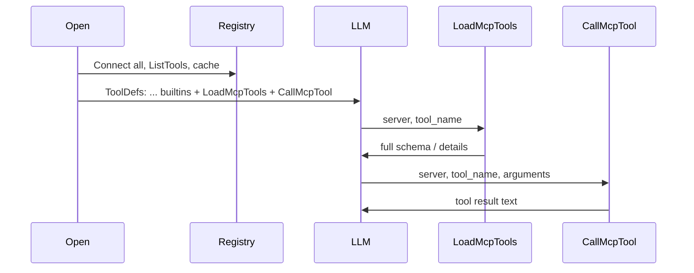

# Design 111 — MCP Protocol Integration (lazy gateway)

## Goal

Load `mcp.json`, connect MCP servers via the official Go SDK (`stdio` / `sse` / `http`), and expose MCP capabilities to the LLM through **two** `core.Tool` entries — **`LoadMcpTools`** and **`CallMcpTool`** — so **tool-definition tokens** stay bounded when many MCP tools exist. Full JSON Schema per tool is returned only when the model calls **`LoadMcpTools`**.

**Product scope:** MCP is enabled **only** for the **`buildmax` CLI** (`cmd/buildmax` → `internal/interface/cli`). Desktop, worker, and other `agentrun.Open` callers keep MCP **off** via an explicit **`OpenInput` flag** (default false).

## Rationale

Flattening every MCP tool into `ToolDefs` duplicates large `parameters` blobs on **every** LLM request. A **catalog + lazy schema + single call surface** avoids that cost while keeping a clear protocol: discover → load schema → call.

## Modules

| Package | Responsibility |
|---------|----------------|
| **`internal/config`** | Resolve `mcp.json` path; parse `mcpServers`; `BUILDMAX_MCP_CONFIG` in `env_spec.go`. |
| **`internal/infra/mcp`** (new) | **Registry**: server id → `ClientSession` + cached `ListTools` result (summaries + schema source for `LoadMcpTools`). **Gateway**: two tools. Transports per `type`. **`cleanup`** closes all sessions. `import mcpsdk "github.com/modelcontextprotocol/go-sdk/mcp"`. |
| **`internal/execution/agentrun`** | **`OpenInput.EnableMCP`** (default **false**). When **true** and MCP config non-empty: append gateway tools in `buildBaseTools`; store **`mcpCleanup`** on **`Runtime`**; **`Runtime.Close()`** runs registry cleanup. |
| **`internal/interface/cli`** | Only call site that sets **`EnableMCP: true`** (TUI + print). **`defer rt.Close()`** (or equivalent) so MCP sessions exit. |
| **Desktop, executor** | Continue calling `Open` with default **`EnableMCP: false`** — no MCP tools, no SDK connections, no code changes required beyond the new field default. |

**Dependency**: `github.com/modelcontextprotocol/go-sdk` (e.g. `v1.4.1`+).

## Transport mapping (unchanged)

| `type` (JSON) | SDK transport |
|---------------|---------------|
| `stdio` | `mcpsdk.CommandTransport` + `exec.Command` with merged `env` |
| `sse` | `mcpsdk.SSEClientTransport{Endpoint: url}` |
| `http` | `mcpsdk.StreamableClientTransport{Endpoint: url}` |

Per server: `mcpsdk.NewClient(...)`, `session, err := client.Connect(ctx, transport, nil)`.

## Registry and catalog

At **`agentrun.Open`**, when **`in.EnableMCP`** is **true** and `LoadMCPConfigForWorkspace` returns a non-empty config:

1. For each server id (**deterministic order**, e.g. sorted keys): **connect**, **`ListTools`**, on failure **fail fast** (return error from `Open` — user fixes config/network).
2. **Cache** in memory:
   - `*mcpsdk.ClientSession` per server (for `CallTool` and optional re-list),
   - tool list entries (name, description, and raw **input schema** / `Tool` payload needed to serve **`LoadMcpTools`**).
3. Build the **catalog string** appended to **`LoadMcpTools.Description()`**: for each server, list **tool name + one-line description** only (no full JSON Schema in the catalog).

Optional later: optional **`description`** field per server in JSON to enrich catalog; MVP can use server id + `type`.

## Gateway tools

### `LoadMcpTools`

| | |
|--|--|
| **Name** | `LoadMcpTools` (exact; reserved — verify no builtin conflict) |
| **Description** | Static instructions + **full catalog** from step 3 above. Explain: call with **`server`** + **`tool_name`** to retrieve **full input schema** and details before calling. |
| **Parameters** | JSON Schema object with at least **`server`** (string), **`tool_name`** (string). |
| **Execute** | Look up cached list for `server`; find `tool_name`; return a concise, LLM-oriented block: description + **full input schema** (e.g. marshaled JSON). Errors: unknown server/tool (`error` return or message with `error: ` prefix per project tool conventions). |

### `CallMcpTool`

| | |
|--|--|
| **Name** | `CallMcpTool` (exact; reserved) |
| **Description** | Instructs model to use **`LoadMcpTools`** first when schema is unknown; then call with **`server`**, **`tool_name`**, **`arguments`**. |
| **Parameters** | **`server`** (string), **`tool_name`** (string), **`arguments`** (object). |
| **Execute** | `session.CallTool(ctx, &mcpsdk.CallToolParams{Name: tool_name, Arguments: arguments})`; serialize `CallToolResult` to text; handle `IsError`. |

**Subagents / agent defs**: User-defined agent tool lists refer to builtins + **`LoadMcpTools` / `CallMcpTool`** if MCP should be available in that subagent — not individual MCP tool names.

## Structure

**New files**

- `internal/config/mcp.go` — types, path resolution, load/parse (missing file → `nil`).
- `internal/infra/mcp/registry.go` — `Registry` struct, connect-all + list-all for catalog, lookup by `(server, tool_name)`.
- `internal/infra/mcp/gateway_tools.go` — `LoadMcpTools` + `CallMcpTool` as `core.Tool` implementations holding `*Registry`.
- `internal/infra/mcp/transport.go` — `transportFor(cfg MCPServerConfig) (mcpsdk.Transport, error)` or similar.
- Tests: `mcp_test.go`, `gateway_test.go` with in-memory transport / mock session where possible.

**Modified**

- `go.mod` / `go.sum`, `env_spec.go`, `.env.example`, `internal/execution/agentrun/runtime.go` (`OpenInput`, conditional MCP init), **`internal/interface/cli`** (`EnableMCP: true`, `Close` on exit).
- **Not modified for MCP**: `internal/execution`, `internal/interface/desktop` (they inherit `EnableMCP == false`).

## Method design (summary)

| API | Responsibility |
|-----|----------------|
| `config.LoadMCPConfigForWorkspace` | Resolve + parse; `nil` if disabled. |
| `mcpservers.NewRegistry(ctx, cfg) (*Registry, error)` | Connect all, list all, build catalog; **fail fast** on any server failure. |
| `(*Registry) Close() error` | Close all sessions (idempotent). |
| `(*Registry) CatalogDescription() string` | For embedding in `LoadMcpTools.Description()`. |
| `(*Registry) ToolSchemaDetail(server, toolName string) (string, error)` | For `LoadMcpTools.Execute`. |
| `(*Registry) CallTool(ctx, server, toolName string, args map[string]any) (string, error)` | For `CallMcpTool.Execute`. |
| `mcpservers.GatewayTools(reg *Registry) []core.Tool` | Returns two tools in stable order. |
| `agentrun.Open` | If **`in.EnableMCP`** and cfg non-empty: `NewRegistry`, `GatewayTools`, append, `mcpCleanup = reg.Close`. Else: no MCP. |
| `agentrun.OpenInput` | New field **`EnableMCP bool`** (JSON tag omitted — Go-only). |

**`buildBaseTools`**: Add `context.Context` if needed for `NewRegistry` (or use `context.Background()` in `Open` for MCP init).

## Lifecycle

- **Open**: Build registry + catalog; failure → no `Runtime` (or return error).
- **Close**: `Registry.Close()` terminates stdio children and HTTP/SSE sessions per SDK.

## Flow

## Tests

- Config: path order, validation, missing file.
- Registry + mock: catalog string shape; `ToolSchemaDetail` for known tool; `CallTool` invokes SDK with expected params.
- Open integration (light): with **`EnableMCP: true`** and config present, agent includes two MCP tools; with **`EnableMCP: false`**, never includes them.

## Changes for review

- **New**: `internal/config/mcp.go`, `internal/infra/mcp/*.go`, tests.
- **Modified**: `go.mod`, `env_spec`, `.env.example`, `agentrun/runtime.go`, **`internal/interface/cli` only** for `EnableMCP` + `Close`.
- **Dropped vs earlier draft**: Per-MCP `core.Tool` flattening; collision-prefix logic for each MCP tool name.
