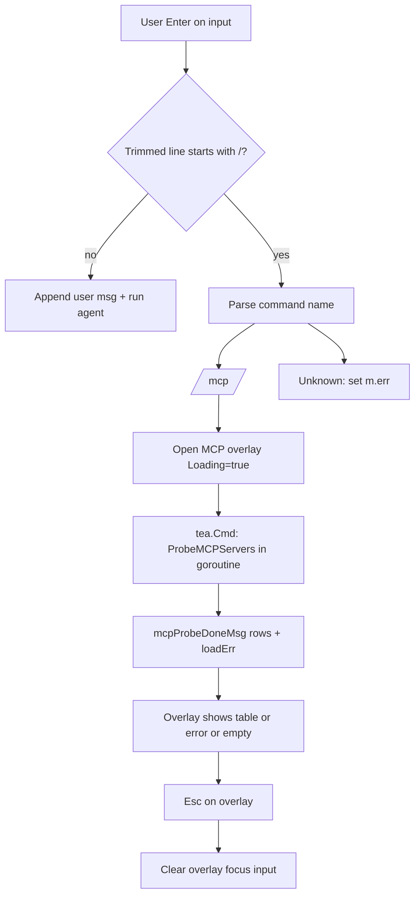

# Design: Task 113 — TUI slash commands and `/mcp` system overlay

**Source spec:** [.vibe/113.md](113.md).

## Goal

Intercept **`/…`** input in the Bubble Tea TUI as **system tools** (no session append, no LLM). Implement **`/mcp`** to open a **full-screen-style overlay** listing MCP servers (id, type, live connected / error); **Esc** closes the overlay and refocuses the input. Add **`mcpservers.ProbeMCPServers`** (or equivalent) for per-server connect + `tools/list` + close, independent of the long-lived runtime registry.

## Modules

| Package | Role |
|---------|------|
| `internal/config` | Unchanged; TUI calls `LoadMCPConfigForWorkspace(workspace)` (same merge + expand rules as CLI). |
| `internal/mcpservers` | New **probe** API: per-server connect attempt, tool count on success, structured row for UI; reuses `newTransport`, `listAllTools`, same SDK client `Implementation` as `NewRegistry`. |
| `internal/tui` | Slash parsing on Enter; overlay state + rendering + key routing; async `tea.Cmd` for probe (no blocking `Update`). |
| `internal/cmd/cli` | No struct changes if workspace already on `TUIOpts.Workspace`; optional import churn only if tests need new exports (they should not). |

## Data flow



## Structure

### `internal/mcpservers`

**New file (recommended):** `probe.go`

**Exported types:**

```go
// MCPServerProbeRow is one server line for diagnostics / TUI.
type MCPServerProbeRow struct {
	ID        string
	Type      string // stdio | sse | http
	OK        bool
	Err       error // nil when OK; Error() shown in UI when !OK
	ToolCount int   // meaningful when OK
}

// ProbeMCPServers connects to each server in cfg independently, runs tools/list,
// closes the session, and returns one row per server (sorted by ID).
// cfg must be non-nil with non-empty MCPServers; callers with nil/empty config should skip calling this.
// httpClient may be nil (package uses http.DefaultClient for sse/http).
func ProbeMCPServers(ctx context.Context, cfg *config.MCPConfigRoot, httpClient *http.Client) []MCPServerProbeRow
```

**Private helper (same file):**

```go
// probeOneServer: newTransport → NewClient → Connect → listAllTools → session.Close
// On any error after Connect, close session; return (0, err).
// On success return (len(tools non-nil names), nil).
func probeOneServer(ctx context.Context, id string, entry config.MCPServerConfig, httpClient *http.Client) (toolCount int, err error)
```

**Behavior:**

- Sort server IDs with `slices.Sort` (same as `NewRegistry`).
- **Context:** caller passes a **deadline** (e.g. `context.WithTimeout(context.Background(), 45*time.Second)` from TUI) so the whole probe batch cannot hang forever; optional per-server timeout can be derived with `context.WithTimeout` per iteration if we want fairness (design leaves to implementer; recommend at least a **parent** timeout from TUI).
- **No** reuse of `Runtime` registry; each `/mcp` may briefly spawn stdio subprocesses (documented in spec).

**Tests (`probe_test.go`):**

- `ProbeMCPServers` with cfg containing one **stdio** server whose `command` is invalid or exits immediately → one row with `OK == false`, `Err != nil`.
- Nil or empty `MCPServers`: either document as caller responsibility or return `nil` slice without error (TUI handles empty config before calling probe).

### `internal/tui`

**`model.go` — new fields on `Model`:**

```go
mcpOverlay *mcpOverlayState // nil = closed

type mcpOverlayState struct {
	Loading   bool
	LoadError string   // config load/parse error (from LoadMCPConfigForWorkspace)
	Rows      []mcpservers.MCPServerProbeRow // valid when !Loading && LoadError == ""
}
```

**New message type (unexported, same file or `messages.go`):**

```go
type mcpProbeDoneMsg struct {
	LoadError string                      // non-empty if LoadMCPConfigForWorkspace failed
	Rows      []mcpservers.MCPServerProbeRow // used when LoadError == "" and config had servers
	Empty     bool                        // true when config loaded OK but no servers
}
```

**`runMCPProbeCmd(workspace string) tea.Cmd`:**

- Goroutine:
  1. `cfg, err := config.LoadMCPConfigForWorkspace(workspace)`  
     - On error → send `mcpProbeDoneMsg{LoadError: err.Error()}`
  2. If `cfg == nil || len(cfg.MCPServers)==0` → send `mcpProbeDoneMsg{Empty: true}`
  3. Else `ctx, cancel := context.WithTimeout(...); defer cancel()` → `rows := mcpservers.ProbeMCPServers(ctx, cfg, nil)` → send `mcpProbeDoneMsg{Rows: rows}`  
- Return `func() tea.Msg { return <-ch }` pattern (same as agent channel) **or** a dedicated channel field on model only for MCP (prefer **returning** a cmd that blocks on a local channel created inside the cmd closure to avoid extra `Model` fields).

**`handleKeyMsg` ordering (critical):**

1. `Ctrl+C` → `tea.Quit` (unchanged).
2. **`mcpOverlay != nil`:**  
   - `Esc` → set `mcpOverlay = nil`, `focusInput = true`, `m.err = ""` (optional), return `tea.Batch(textarea.Blink, m.inputBlock.Focus())`.  
   - Other keys: **consume** (return `m, nil`) so Tab / arrows do not scroll viewport or flip focus underneath.  
   - **Do not** delegate to `inputBlock` while overlay is open (textarea should be blurred when overlay opens).
3. Rest of existing logic (Tab, viewport focus, scroll keys, input Esc, Enter, …).

**Enter handling when `focusInput && !busy`:**

After reading `text := strings.TrimSpace(m.inputBlock.Value())`:

- If `strings.HasPrefix(text, "/")` → reset input + sync height; parse first field `strings.Fields(text)[0]` or split on space: `"/mcp"` exact match (and optionally `"/mcp"` with trailing spaces already trimmed).  
  - **`/mcp`:** `m.inputBlock.Reset()`, `m.inputBlock.Blur()`, `m.focusInput = false` **or** keep `focusInput` true but overlay steals keys — simpler to set `focusInput = true` but blur textarea and still route keys via overlay branch first. **Recommended:** `mcpOverlay = &mcpOverlayState{Loading: true}`, `m.inputBlock.Blur()`, return `runMCPProbeCmd(m.opts.Workspace)`.  
  - **Unknown** `/foo`:** set `m.err = "unknown command …"`, clear input, return `nil` (no overlay).
- Else existing chat path (append user, agent, …).

**`Update` switch:** add `case mcpProbeDoneMsg:` → `handleMCPProbeDone` sets `mcpOverlay.Loading = false`, fills `LoadError` / `Rows` / empty state.

**`View()` layering:**

- Compute `base := strings.Join([]string{viewport, input, footer}, "\n")` as today.
- If `mcpOverlay == nil`, return `base`.
- Else render **overlay panel** with `lipgloss.Place(m.width, m.height, lipgloss.Center, lipgloss.Center, panel)` (or top-aligned box) so it sits on top of `base` (same pattern as modals: `lipgloss.JoinVertical` / `Place` overlay). Panel content:
  - Title: `MCP servers`
  - Loading: `Probing…`
  - LoadError: show error string + hint
  - Empty: short copy + `~/.buildmax/mcp.json` / workspace `.buildmax/mcp.json` / `BUILDMAX_MCP_CONFIG`
  - Rows: one line per row `id | type | connected | tools=N` or `id | type | error: …` (truncate long errors for width)

**New file (recommended):** `mcp_overlay.go` — `func (m *Model) renderMCPOverlay() string` and lipgloss styles (reuse `lightSkyBlue` / borders consistent with input box).

**`handleWindowSize`:** overlay uses `m.width`/`m.height`; no extra state.

**`handleMouseMsg`:** if `mcpOverlay != nil`, return `m, nil` (ignore mouse under overlay for v1).

**Footer (`renderFooterView`):** when `mcpOverlay != nil`, append `| esc: close MCP list` to line2; when nil, add minimal hint `| /mcp: MCP status` (wording per 113.md).

## Method design summary

| Symbol | Responsibility |
|--------|------------------|
| `mcpservers.ProbeMCPServers` | Independent per-server probe; sorted rows; closes sessions. |
| `mcpservers.probeOneServer` | Single-server connect + list + close. |
| `runMCPProbeCmd` | Async load config + probe; returns `tea.Msg`. |
| `handleMCPProbeDone` | Fill `mcpOverlay` from message. |
| `renderMCPOverlay` | Lipgloss panel from `mcpOverlayState`. |
| `handleKeyMsg` (early branch) | Overlay consumes keys; Esc closes. |
| Enter `/…` branch | Dispatch `/mcp` vs unknown; never `session.Append`. |

## How they work together

1. User types `/mcp`, Enter → input cleared, overlay **loading**, probe command scheduled.
2. Goroutine loads merged MCP config for `TUIOpts.Workspace`; on success runs `ProbeMCPServers`; sends `mcpProbeDoneMsg`.
3. Model updates overlay body; user reads list; Esc clears overlay and refocuses textarea (Blink + Focus).
4. Chat viewport **never** receives slash lines or probe output as messages.

## Changes for review

| Area | Change |
|------|--------|
| `internal/mcpservers/probe.go` | **New:** `MCPServerProbeRow`, `ProbeMCPServers`, `probeOneServer`. |
| `internal/mcpservers/probe_test.go` | **New:** failure-path / empty-input tests (no real MCP servers). |
| `internal/tui/model.go` | Overlay state; `mcpProbeDoneMsg`; `Update` case; Enter slash branch; `handleKeyMsg` early overlay; `View` compose overlay; mouse guard. |
| `internal/tui/mcp_overlay.go` | **New:** overlay rendering + styles. |
| `internal/tui/model_test.go` | Slash: no session length change; overlay open after `/mcp` + Esc closes (may inject `runMCPProbeCmd` stub via testing hook **or** test only synchronous path by sending `mcpProbeDoneMsg` manually in tests — prefer **manual msg** + fake rows to avoid real probe in tests). |

## Risks / notes

- **Double stdio spawn:** `/mcp` probe starts processes separately from the runtime registry; acceptable per spec.
- **Latency:** Large configs may take seconds; loading state is required.
- **Focus:** Blur textarea when overlay opens so typed keys do not fill input underneath; Esc restores Focus.
