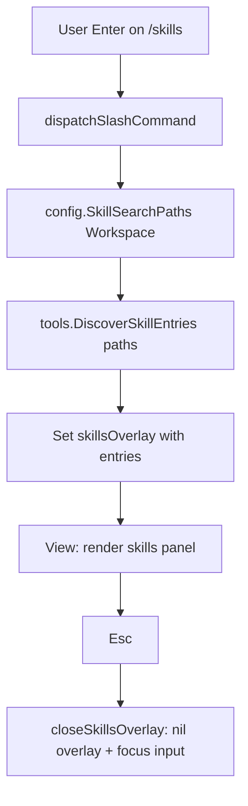

# Design: Task 114 — TUI `/skills` slash command

**Source spec:** [.vibe/114.md](114.md).

## Goal

Add **`/skills`** to the Bubble Tea TUI: a **system-only** slash command that opens a **panel above the input** listing filesystem skills discoverable via the same rules as `tools.NewSkill`, with **Esc** to dismiss. **No** session append, **no** LLM, **no** async I/O (pure disk scan).

## Modules

| Package | Role |
|---------|------|
| `internal/execution/agenttool` | Export **`DiscoverSkillEntries(searchPaths []string) []SkillEntry`**; **`NewSkill`** calls it instead of unexported `discoverSkills` so discovery logic stays single-sourced. |
| `internal/config` | Unchanged; TUI uses existing **`SkillSearchPaths(workspace)`**. |
| `internal/interface/tui` | Slash registration + dispatch; **`skillsOverlayState`** + render + Esc + viewport height; optional footer hint. |
| `internal/execution/agentrun` | No change (already passes paths into `NewSkill`). |

## Data flow



Unlike `/mcp`, there is **no** `tea.Cmd` goroutine or follow-up message type: discovery is cheap enough to run synchronously inside **`dispatchSlashCommand`** (or a tiny helper called from it).

## Structure

### `internal/execution/agenttool/skill.go`

1. **Rename / replace** the unexported scanner:
   - **`DiscoverSkillEntries(searchPaths []string) []SkillEntry`** — same body as today’s `discoverSkills` (log, skip missing dirs, first-path-wins, sort by name). Document that it is the **single** discovery entry used by **`NewSkill`** and callers that need a listing.

2. **`NewSkill`**

   ```go
   skills := DiscoverSkillEntries(searchPaths)
   ```

   Build `byName` from `skills` as today.

3. **Remove** the standalone `discoverSkills` identifier (logic lives in `DiscoverSkillEntries`).

**Tests (`skill_test.go`):**

- Add **`TestDiscoverSkillEntries_*`** (or extend existing tests): table-driven cases using **`t.TempDir()`** — e.g. no dirs, one skill with `SKILL.md`, two roots with same skill name (first path wins), description extraction unchanged. Reuse fixtures/helpers already used by `NewSkill` tests where possible.

### `internal/interface/tui`

**New file (recommended):** `skills_overlay.go`

**State:**

```go
// skillsOverlayState is the /skills system panel above the input (not part of chat session).
type skillsOverlayState struct {
	Entries []tools.SkillEntry // sorted by name; empty slice = empty state
}
```

- **Non-empty:** `len(Entries) > 0`.
- **Empty:** `len(Entries) == 0` — show empty-state copy (workspace `.buildmax/skills` + global `DataDir()/skills`).

**Functions:**

| Name | Responsibility |
|------|----------------|
| `openSkillsOverlay(m *Model) (tea.Model, tea.Cmd)` | Set `m.skillsOverlay` from `SkillSearchPaths(m.opts.Workspace)` + `DiscoverSkillEntries`; clear `m.err` if desired; return `m, nil`. |
| `(m *Model) renderSkillsInlinePanel() string` | If `skillsOverlay == nil`, return `""`. Else `mcpInlineBoxStyle.Width(boxW)` + inner content (same width rules as MCP panel). |
| `(m *Model) buildSkillsOverlayContent(maxLineWidth int) string` | Title line **`Skills`** (reuse **`mcpOverlayTitleStyle`**). Empty vs list body + **`esc: close`** footer line. |
| `closeSkillsOverlay(m *Model) (tea.Model, tea.Cmd)` | Same pattern as **`closeMCPOverlay`**: `skillsOverlay = nil`, `focusInput = true`, `tea.Batch(textarea.Blink, m.inputBlock.Focus())`. |

**Rendering rules:**

- Reuse **`truncateRunes`** from `mcp_overlay.go` (same package).
- Reuse a line budget constant — either **`mcpInlinePanelMaxContentLines`** or a local **`skillsPanelMaxContentLines`** set equal to it for consistency.
- **Each skill:** line 1 = **name** (bold optional; at minimum plain) + **description** truncated to fit `maxLineWidth` (name can be a fixed column like MCP’s id column, or `name — desc` on one line if width is tight).
- **Optional path (recommended):** second line, indented, **`slashPopupLineStyle`** or equivalent muted style, **`truncateRunes(path, …)`** — keeps spec’s “secondary path” without cluttering line 1.

**`model.go`**

- Add field: **`skillsOverlay *skillsOverlayState`**.
- **`View`**: Insert skills panel **between** MCP and session so vertical order stays: viewport → MCP → **skills** → session → slash popup → input → footer.  
  - Rationale: MCP and skills are both “capabilities/config”; session list remains just above the input as today; **Esc** order below matches “close panels from input toward viewport.”
- **`syncViewportSize`**: Add **`lipgloss.Height(renderSkillsInlinePanel())`** into **`extra`** (same as MCP/session).
- **`handleKeyMsg` — `tea.KeyEscape`**: Extend the existing branch so **`skillsOverlay`** is closed **after** **`sessionOverlay`** and **before** **`mcpOverlay`**, matching bottom-up dismissal for the stack **viewport → MCP → skills → session → … → input** (session is nearest the input among the three).  
  - **Concrete chain:** `slashPopup` → **`sessionOverlay`** → **`skillsOverlay`** → **`mcpOverlay`** → clear input.

**`slash.go`**

- **`builtinSlashCommands`**: add **`"/skills"`** (sorted: `/mcp`, `/session`, `/skills`).
- **`dispatchSlashCommand`**: `case "/skills":` → **`openSkillsOverlay`** (or inline path + entries + assign overlay).
- **Default branch:** extend unknown-command string to include **`/skills`** with **`/mcp`** and **`/session`**.

**`renderFooterView`**

- If **`skillsOverlay != nil`**, append **`| esc: close skills panel`** (same pattern as session/MCP lines).

### Method design summary

```go
// internal/execution/agenttool
func DiscoverSkillEntries(searchPaths []string) []SkillEntry

func NewSkill(searchPaths []string) (*SkillTool, error) // uses DiscoverSkillEntries internally

// internal/interface/tui (skills_overlay.go + model.go + slash.go)
func openSkillsOverlay(m *Model) (tea.Model, tea.Cmd)
func (m *Model) renderSkillsInlinePanel() string
func (m *Model) buildSkillsOverlayContent(maxLineWidth int) string
func closeSkillsOverlay(m *Model) (tea.Model, tea.Cmd)
```

## How they work together

1. User types **`/skills`** and submits (Enter with or without completion popup).
2. **`dispatchSlashCommand`** runs **`config.SkillSearchPaths(m.opts.Workspace)`** → **`tools.DiscoverSkillEntries`** → sets **`m.skillsOverlay`**.
3. **`View`** draws the panel; **`syncViewportSize`** shrinks the viewport height so the layout does not overflow.
4. **Esc** clears **`skillsOverlay`** via **`closeSkillsOverlay`** and refocuses the textarea.
5. Agent’s **`SkillTool`** continues to use the same discovery via **`NewSkill`** → **`DiscoverSkillEntries`**.

## Tests

| Location | Cases |
|----------|--------|
| `internal/execution/agenttool` | `DiscoverSkillEntries` parity with prior `NewSkill` discovery (fixtures under temp dirs). |
| `internal/interface/tui` (`model_test.go` or new test file) | Submit **`/skills`** with `TUIOpts.Workspace` pointing at a temp dir tree containing **`skills/<name>/SKILL.md`**: **`session.Messages` unchanged**, **`busy`** never set; **`skillsOverlay != nil`** and rendered body contains skill **name** (and optionally path); Esc transitions **`skillsOverlay == nil`**, **`FocusInput() == true`**. Empty workspace skills dirs → empty state string present, still no session append. |

No network, no external binaries.

## Changes for review

| Area | Change |
|------|--------|
| `internal/execution/agenttool/skill.go` | Add **`DiscoverSkillEntries`**; **`NewSkill`** uses it; remove **`discoverSkills`**. |
| `internal/execution/agenttool/skill_test.go` | Tests for **`DiscoverSkillEntries`**. |
| `internal/interface/tui/skills_overlay.go` | **New** — state, open/render/build/close. |
| `internal/interface/tui/model.go` | **`skillsOverlay`** field; **`View`** + **`syncViewportSize`** + **Esc** chain + **`renderFooterView`**. |
| `internal/interface/tui/slash.go` | **`/skills`** builtin + dispatch + unknown-command text. |

**Risk / note:** If both **MCP** and **skills** panels were ever shown at once, layout stacks them; normal UX is one at a time. No change required beyond correct **Esc** ordering.
