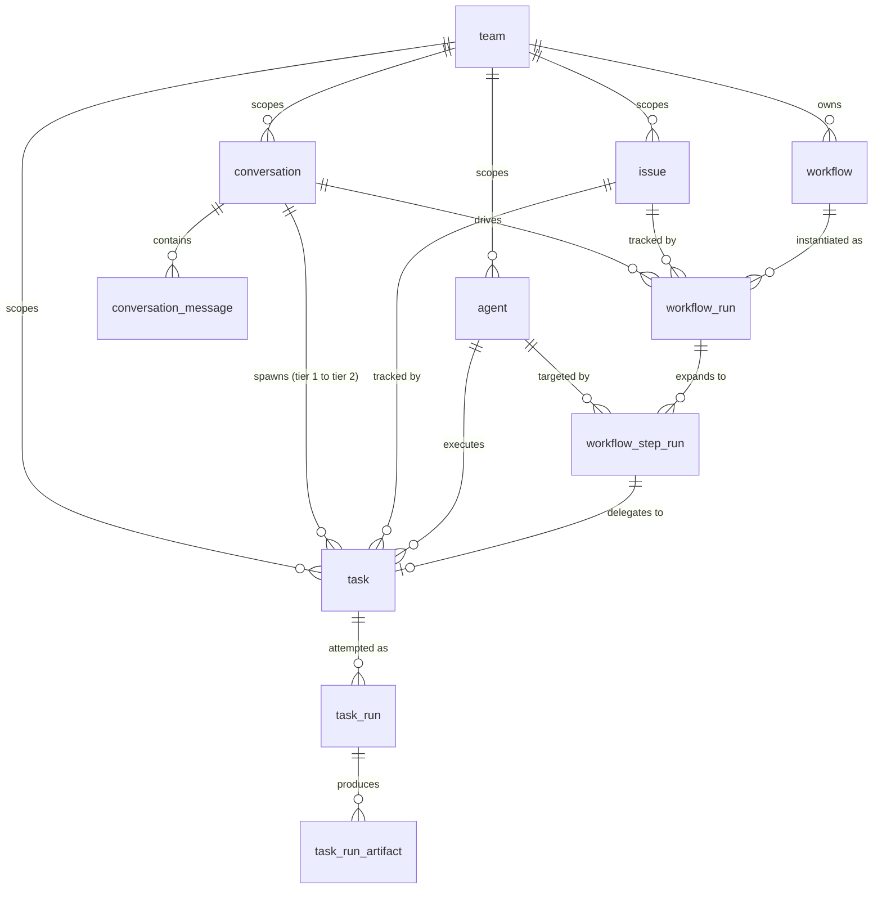
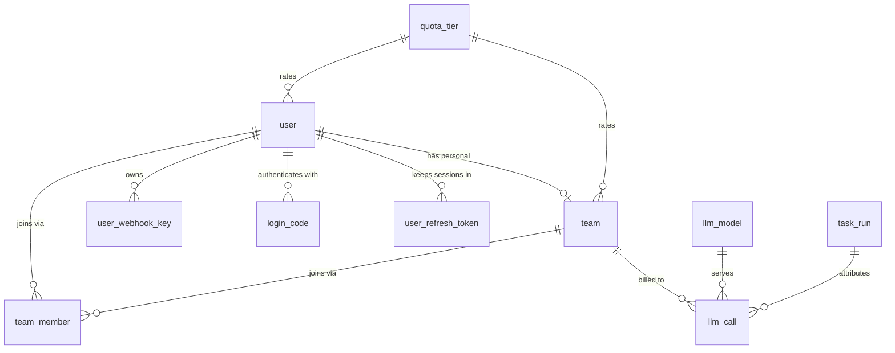

# Data Model

> **Audience:** contributors · **Status:** current

The full relational schema of the BuildMax server database: every table, every
column, and the rules for changing them. Read this before touching anything
under `internal/infra/db`.

For the layering around persistence — which package owns contracts versus the
implementation — see [store.md](store.md). For why the entities are shaped this
way, see [../../design/product-vision.md](../../design/product-vision.md) and
[../../design/team-governance.md](../../design/team-governance.md).

## Where The Schema Lives

There is no `.sql` file describing the current schema. The source of truth is
the set of unexported `xxxRow` structs in `internal/infra/db`, and their GORM
tags. `New` in `internal/infra/db/store.go` calls `AutoMigrate` over all 21 of
them at server startup, so the running database is whatever those structs say.

The CLI and Desktop surfaces do not use this database at all. Sessions, traces,
and settings are files under `<BUILDMAX_HOME>`; see
[session.md](session.md). Everything below exists only in a server deployment.

## Conventions

These hold for every table. They are not repeated in the per-table sections.

**Two identifiers per row.** `id` is an auto-increment `uint` primary key that
never leaves the process — the Go structs tag it `json:"-"`. The public
identifier is a separate `varchar(64)` column named after the entity
(`task_id`, `issue_id`, …) carrying a prefixed ID from `NewPrefixedID` in
`internal/util/id.go`: `u_` user, `tm_` team, `i_` issue, `a_` agent, `w_`
workflow, `wr_` workflow run, `wsr_` workflow step run, `c_` conversation,
`cm_` conversation message, `t_` task, `r_` task run, `whk_` webhook key, `lc_`
LLM call, `lm_` LLM model, `as_` auth session. Every API path, foreign reference, and log line uses
the prefixed ID. Join on it, not on `id`.

**Session IDs are the exception.** `task.session_id` and `task_run.session_id`
are `varchar(36)` UUIDs, not prefixed IDs, and they point at a session file
under the run's `BUILDMAX_HOME` rather than at any table.

**No database-level foreign keys.** No row struct declares a GORM relation, so
`AutoMigrate` emits no `FOREIGN KEY` constraints. Every reference described in
this document is a plain indexed column that application code is responsible
for keeping consistent. Deleting a parent row does not cascade.

**Timestamps are Unix seconds in `bigint` columns**, never `DATETIME` and never
milliseconds. Columns tagged `autoCreateTime` / `autoUpdateTime` are filled by
GORM; the rest are set explicitly with `time.Now().Unix()`. A nullable
timestamp is a `*int64` in Go, and its absence is meaningful — `ended_at IS
NULL` means still running, not unknown.

**Nullability is narrower than the Go type suggests.** `AutoMigrate` only emits
`NOT NULL` where a tag says so. A non-pointer Go field without `not null` maps
to a nullable column that application code never actually writes `NULL` into —
it writes the zero value. The `Null` column below reports the *database*
constraint; treat "yes" on a non-pointer field as "nullable in DDL, empty
string or 0 in practice".

**Names.** Table names are singular. Columns and JSON fields are `snake_case`.
Enumerated values are stored as strings, not integers, and the constants live in
`internal/core/model` — the spelling is inconsistent by table and is called out
in each section (`task_run.status` shouts, `issue.status` does not).

## Entity Relationships

The work graph — what a user actually creates and runs:

Identity, authorization, and platform tables:

Team is the authorization boundary: a request is allowed because the caller has
a `team_member` row for the resource's `team_id`. Issue is the primary
user-facing work object. Conversation is Tier 1 and speaks to the user; task
plus task_run is Tier 2 and reports back through Tier 1. See
[../../design/surface-positioning.md](../../design/surface-positioning.md).

## Identity And Authorization

### `user`

One row per person. Created by an operator; self-registration is disabled by
default (see [../../deploy/authentication.md](../../deploy/authentication.md)).

| Column | Type | Null | Notes |
|---|---|---|---|
| `id` | `bigint unsigned` | no | Auto-increment primary key, internal |
| `user_id` | `varchar(64)` | no | Public ID, `u_` prefix, unique |
| `email` | `varchar(255)` | no | Unique; the login identifier |
| `name` | `varchar(255)` | yes | Display name |
| `password_hash` | `varchar(255)` | yes | argon2id, PHC-encoded. `NULL` until a password is set |
| `password_set_at` | `bigint` | yes | Unix seconds |
| `quota_tier` | `varchar(64)` | yes | References `quota_tier.tier_name` |
| `last_login_at` | `bigint` | yes | Unix seconds |
| `last_login_platform` | `varchar(32)` | yes | Where the last login came from |
| `created_at` | `bigint` | yes | `autoCreateTime` |

Indexes: PK `id`; unique `user_id`; unique `email`.

`last_login_at` and `last_login_platform` are carried through the store mapping
but no server code path currently writes them — only the in-memory store in
`internal/mock` does. Treat them as reserved, not as a login audit trail.

`password_hash` is nullable and read only by the code that verifies a login,
through `model.PasswordStore` rather than as a field on `model.User`. It never
rides along on a user object, so no handler can serialize it by accident.
Nullable is also what leaves room for an account authenticated somewhere else:
an identity provider, when there is one, needs no local password to exist.

### `team`

The ownership and authorization boundary for every Portal resource.

| Column | Type | Null | Notes |
|---|---|---|---|
| `id` | `bigint unsigned` | no | Internal primary key |
| `team_id` | `varchar(64)` | no | Public ID, `tm_` prefix, unique |
| `name` | `varchar(255)` | no | Display name |
| `personal_for_user_id` | `varchar(64)` | yes | Set on a user's personal team; unique, so a user has at most one |
| `quota_tier` | `varchar(64)` | yes | References `quota_tier.tier_name` |
| `created_by` | `varchar(64)` | no | `user.user_id` |
| `created_at` | `bigint` | yes | `autoCreateTime` |
| `updated_at` | `bigint` | yes | `autoUpdateTime` |

Indexes: PK `id`; unique `team_id`; unique `personal_for_user_id`.

Every user gets a personal team named `My Space`
(`model.DefaultPersonalTeamName`). It is a real team row, not a special case in
the authorization code, which is why quota and membership work identically for
solo and shared use.

That arrangement is deliberate and load-bearing. Before teams existed, issues,
agents, and conversations hung off `user_id`, and a Portal request resolved as
`JWT -> user_id -> store query -> ownership check`. Team replaced that in April
2026 — before the public history was squashed, so `git log` does not show the
transition — with one rule: every working resource belongs to a team, and a
solo user simply owns a team of one. The point was to make sharing a
membership change rather than a data migration.

Two consequences bind new code:

- **Do not add a user-scoped path around a team-scoped resource.** A handler
  that resolves ownership from `user_id` alone reintroduces the model Team
  replaced, and it will diverge from quota, membership, and every authorization
  check that reads `team_member`.
- **Solo users must never have to learn the concept.** The personal team is
  created for them and named for them; surfacing team selection, invitations,
  or roles on a path a single user must walk is a regression, not a feature.

### `team_member`

The membership join table, and the row every authorization check looks for.

| Column | Type | Null | Notes |
|---|---|---|---|
| `id` | `bigint unsigned` | no | Internal primary key |
| `team_id` | `varchar(64)` | no | `team.team_id` |
| `user_id` | `varchar(64)` | no | `user.user_id` |
| `role` | `varchar(32)` | no | `owner`, `admin`, or `member` |
| `created_at` | `bigint` | yes | `autoCreateTime` |

Indexes: PK `id`; unique composite `uq_team_member_team_user` on
(`team_id`, `user_id`).

Roles are `model.TeamRoleOwner` / `TeamRoleAdmin` / `TeamRoleMember`. Team
approvals and an audit log are designed but not implemented; do not read this
table as an approval record.

### `login_code`

Single-use email login codes. Rows are consumed, not deleted on use.

| Column | Type | Null | Notes |
|---|---|---|---|
| `id` | `bigint unsigned` | no | Internal primary key |
| `code_hash` | `varchar(128)` | no | Hash of the emailed code, unique — the plaintext is never stored |
| `user_id` | `varchar(64)` | no | `user.user_id` |
| `expires_at` | `bigint` | no | Unix seconds; default TTL is one hour (`model.LoginCodeTTLDefault`) |
| `used_at` | `bigint` | yes | Non-`NULL` means already redeemed; a second attempt fails |
| `created_at` | `bigint` | yes | `autoCreateTime` |

Indexes: PK `id`; unique `code_hash`; index `user_id`; index `expires_at`.

### `user_refresh_token`

The stored half of a login. Signing in returns a signed access token, which the
server keeps no record of, plus a refresh token, which is a row here. That split
is what makes a session revocable: the credential that lives for weeks is the
one the server can retire.

Each row belongs to a `session_id` — one login chain. Every exchange spends the
presented token and issues a new one in the same session, so revoking a session
retires the chain however many times it has been renewed.

| Column | Type | Null | Notes |
|---|---|---|---|
| `id` | `bigint unsigned` | no | Internal primary key |
| `token_hash` | `varchar(128)` | no | Hash of the token, unique — the plaintext is returned once and never stored |
| `user_id` | `varchar(64)` | no | `user.user_id` |
| `session_id` | `varchar(64)` | no | `as_` prefix; one login chain, preserved across every rotation |
| `platform` | `varchar(32)` | yes | Which surface logged in — a label for the reader, not enforced |
| `expires_at` | `bigint` | no | Unix seconds; default TTL is 30 days (`model.RefreshTokenTTLDefault`) |
| `used_at` | `bigint` | yes | Non-`NULL` means already exchanged |
| `revoked_at` | `bigint` | yes | Non-`NULL` means retired by a logout or a reuse report |
| `replaced_by` | `varchar(128)` | yes | Hash of the token issued in exchange; lets an operator walk a chain back to its login |
| `created_at` | `bigint` | yes | `autoCreateTime` |

Indexes: PK `id`; unique `token_hash`; index `user_id`; index `session_id`;
index `expires_at`.

A token presented after it was already exchanged means two holders, so the
store revokes the whole session rather than guessing which one is legitimate.
The exception is a short grace window after an exchange, which exists because
the CLI and Desktop share one credentials file between processes and refreshing
twice at once is normal there. Rows are swept once they expire; revoked rows are
kept until then, so a reuse report still has a chain to inspect.

### `user_webhook_key`

API keys for the inbound webhook surface documented in
[../../reference/webhook.md](../../reference/webhook.md).

| Column | Type | Null | Notes |
|---|---|---|---|
| `id` | `bigint unsigned` | no | Internal primary key |
| `key_id` | `varchar(64)` | no | Public ID, `whk_` prefix, unique |
| `user_id` | `varchar(64)` | no | `user.user_id` — keys are user-scoped, not team-scoped |
| `key_hash` | `varchar(128)` | no | Unique; the secret is shown once at creation and never again |
| `name` | `varchar(255)` | yes | Human label |
| `created_at` | `bigint` | yes | `autoCreateTime` |

Indexes: PK `id`; unique `key_id`; unique `key_hash`; index `user_id`.

### `quota_tier`

Rate limits, referenced by name from `user.quota_tier` and `team.quota_tier`.
This is the one table whose primary key is not `id`.

| Column | Type | Null | Notes |
|---|---|---|---|
| `tier_name` | `varchar(64)` | no | Primary key |
| `max_runs_per_period` | `int` | no | Task runs allowed per window |
| `max_tokens_per_period` | `int` | no | Prompt plus completion tokens per window |
| `period_days` | `int` | no | Window length |

Indexes: PK `tier_name`.

`SeedDefaultQuotaTiers` inserts `free_trial` (10 runs, 100,000 tokens, 30 days)
and `pro` (1,000 runs, 10,000,000 tokens, 30 days) at startup, but only when
the table is empty — an operator who edits a tier will not have it overwritten
on restart.

There is deliberately **no usage table**. `TeamUsageInWindow` aggregates on
read: it counts `task_run` rows joined to `task` by team, sums their
`prompt_tokens` and `completion_tokens`, and adds the title-generation tokens
recorded on tasks created in the same window. Metering therefore has no second
write path that can drift out of sync with the runs themselves.

### `audit_event`

Governance evidence: that an action happened and who performed it. Append-only —
there is no update or delete path in `internal/infra/db/audit.go`, because a
record that can be edited is not evidence.

| Column | Type | Null | Notes |
|---|---|---|---|
| `id` | `bigint unsigned` | no | Internal primary key |
| `audit_event_id` | `varchar(64)` | no | Public ID, `ae_` prefix, unique |
| `team_id` | `varchar(64)` | yes | Empty for actions with no team, such as a login |
| `created_at` | `bigint` | no | Unix seconds |
| `actor_type` | `varchar(16)` | no | `user`, `worker`, or `system` |
| `actor_id` | `varchar(64)` | no | User ID, or a process name for `system` |
| `action` | `varchar(64)` | no | `user.login`, `user.logout`, `user.password_set`, `auth.refresh_reuse`, `team.member_added`, `llm_model.created`, `access.denied`, … |
| `target_type` / `target_id` | `varchar(32)` / `varchar(64)` | yes | What the action was performed on |
| `detail` | `varchar(255)` | yes | A short non-sensitive note — a role name, a model alias |

Indexes: PK `id`; unique `audit_event_id`; composite (`team_id`, `created_at`)
because reading is always "this team, newest first"; index `actor_id`; index
`action`.

Action strings are persisted and therefore permanent: renaming one rewrites
history for every reader that filters on it. They are declared in
`internal/core/model/audit.go`.

**No prompts, generated content, tool output, or credentials.** This table
answers a governance question; run diagnostics belong to the durable run trace
and per-call accounting to `llm_call`. Recording the same fact in two places
would give it two retention policies and two chances to disagree.

Writes go through `internal/service/audit`, which logs a failed insert rather
than failing the action that caused it. That is a deliberate trade with a real
cost: the table records what happened while the database was reachable, not
every action that occurred. A deployment needing the stronger property has to
make the write part of the same transaction as the action.

### `schema_migration`

One row per applied migration. It is the record of what has been done to a
database, and the reason each migration runs at most once.

| Column | Type | Null | Notes |
|---|---|---|---|
| `id` | `varchar(191)` | no | Primary key; the migration's permanent identifier. 191 is MySQL's longest indexable `varchar` under `utf8mb4` |
| `applied_at` | `bigint` | no | Unix seconds |

Indexes: PK `id`.

Rows are never deleted. A missing row means that migration runs again, which is
what makes recovery from a crash mid-migration work and what makes deleting a
row a way to corrupt a database.

The table also tells a binary that the database is ahead of it: an ID here that
the binary does not know is a migration from a later release. See
[Forward Only, One Release Back](#forward-only-one-release-back).

## Work Objects

### `issue`

The primary user-facing work object.

| Column | Type | Null | Notes |
|---|---|---|---|
| `id` | `bigint unsigned` | no | Internal primary key |
| `issue_id` | `varchar(64)` | no | Public ID, `i_` prefix, unique |
| `user_id` | `varchar(64)` | no | Owning user |
| `team_id` | `varchar(64)` | yes | Owning team; the authorization key |
| `title` | `varchar(255)` | no | |
| `description` | `text` | no | |
| `status` | `varchar(32)` | no | `todo`, `in_progress`, `done` |
| `assignee_kind` | `varchar(32)` | yes | `person`, `agent`, or `workflow` |
| `assignee_id` | `varchar(64)` | yes | Interpreted according to `assignee_kind`: a `user_id`, `agent_id`, or `workflow_id` |
| `created_by` | `varchar(64)` | no | `user.user_id` |
| `created_at` | `bigint` | yes | `autoCreateTime` |
| `updated_at` | `bigint` | yes | `autoUpdateTime` |

Indexes: PK `id`; unique `issue_id`; index `user_id`; index `team_id`.

The `assignee_kind` / `assignee_id` pair is a polymorphic reference — no index
or constraint ties it to a specific table, so validation lives in
`internal/service/issue`.

### `agent`

A stored agent definition: a name plus system instructions that a task can run
under.

| Column | Type | Null | Notes |
|---|---|---|---|
| `id` | `bigint unsigned` | no | Internal primary key |
| `agent_id` | `varchar(64)` | no | Public ID, `a_` prefix, unique |
| `user_id` | `varchar(64)` | no | Owning user |
| `team_id` | `varchar(64)` | yes | Owning team |
| `name` | `varchar(255)` | no | |
| `description` | `text` | yes | Shown in pickers |
| `instructions` | `text` | yes | Appended to the system prompt for runs using this agent |
| `created_at` | `bigint` | yes | `autoCreateTime` |

Indexes: PK `id`; unique `agent_id`; index `user_id`; index `team_id`.

These are server-side agent records. They are distinct from the workspace
subagents defined as Markdown files under `.buildmax/`; see
[../../guide/skills-and-subagents.md](../../guide/skills-and-subagents.md).

### `conversation`

Tier 1. The orchestrator that holds foreground turns and is the single voice to
the user.

| Column | Type | Null | Notes |
|---|---|---|---|
| `id` | `bigint unsigned` | no | Internal primary key |
| `conversation_id` | `varchar(64)` | no | Public ID, `c_` prefix, unique |
| `user_id` | `varchar(64)` | no | Owning user |
| `team_id` | `varchar(64)` | yes | Owning team |
| `channel` | `varchar(32)` | no | `portal`, `telegram`, `cron`, or `webhook` |
| `title` | `varchar(256)` | yes | Generated from the first turn |
| `created_by` | `varchar(64)` | no | `user.user_id` |
| `created_at` | `bigint` | yes | `autoCreateTime` |

Indexes: PK `id`; unique `conversation_id`; index `user_id`; index `team_id`.

Channel constants are in `internal/service/conversation/channel/types.go`.
`system` exists as a constant but is not in `ValidChannels`, so it cannot be
supplied by a caller.

### `conversation_message`

One message in a Tier 1 conversation, including tool traffic.

| Column | Type | Null | Notes |
|---|---|---|---|
| `id` | `bigint unsigned` | no | Internal primary key |
| `conversation_message_id` | `varchar(64)` | no | Public ID, `cm_` prefix, unique |
| `conversation_id` | `varchar(64)` | no | `conversation.conversation_id` |
| `role` | `varchar(16)` | no | LLM message role |
| `content` | `text` | no | |
| `channel` | `varchar(32)` | yes | Overrides the conversation channel for this message |
| `tool_call_id` | `varchar(64)` | yes | Set on a tool result, linking it to the call that produced it |
| `tool_calls` | `text` | yes | JSON array of tool calls on an assistant message; the Go field is `ToolCallsJSON` but the column is `tool_calls` |
| `created_at` | `bigint` | yes | `autoCreateTime` |

Indexes: PK `id`; unique `conversation_message_id`; index `conversation_id`.

Ordering is by `created_at`, then `id`. Prefixed IDs are random, not
time-ordered, so never sort by `conversation_message_id`.

## Background Execution

Task plus task_run is Tier 2: durable background execution that reports results
to Tier 1 rather than speaking to the user directly.

### `task`

The durable unit of background work. One task, many attempts.

| Column | Type | Null | Notes |
|---|---|---|---|
| `id` | `bigint unsigned` | no | Internal primary key |
| `task_id` | `varchar(64)` | no | Public ID, `t_` prefix, unique |
| `conversation_id` | `varchar(64)` | no | The Tier 1 conversation that owns the result |
| `team_id` | `varchar(64)` | yes | Owning team; used by quota aggregation |
| `issue_id` | `varchar(64)` | yes | The issue this task advances, if any |
| `status` | `varchar(32)` | no | `PENDING`, `SCHEDULED`, `RUNNING`, `SUCCEEDED`, `FAILED` |
| `input` | `text` | no | The prompt |
| `title` | `varchar(256)` | yes | LLM-generated |
| `title_prompt_tokens` | `int` | yes | Tokens spent generating the title — counted against quota |
| `title_completion_tokens` | `int` | yes | Same |
| `output` | `text` | yes | Result of the latest successful run |
| `created_by` | `varchar(64)` | no | `user.user_id` |
| `created_at` | `bigint` | yes | `autoCreateTime` |
| `started_at` | `bigint` | yes | First run start |
| `ended_at` | `bigint` | yes | Terminal-status time |
| `error_message` | `text` | yes | |
| `session_id` | `varchar(36)` | yes | UUID of the agent session file, not a table reference |
| `last_run_id` | `varchar(64)` | yes | `task_run.task_run_id` of the most recent attempt |
| `agent_id` | `varchar(64)` | yes | `agent.agent_id` this task runs as |

Indexes: PK `id`; unique `task_id`; index `conversation_id`; index `team_id`;
index `issue_id`; index `last_run_id`; index `agent_id`.

Status values are `model.RunStatus` — uppercase, and shared with `task_run`.

### `task_run`

One execution attempt. This is the row quota and token accounting read.

| Column | Type | Null | Notes |
|---|---|---|---|
| `id` | `bigint unsigned` | no | Internal primary key |
| `task_run_id` | `varchar(64)` | no | Public ID, `r_` prefix, unique |
| `task_id` | `varchar(64)` | no | `task.task_id` |
| `input` | `text` | no | Prompt for this attempt; a rerun may differ from the task's |
| `created_by` | `varchar(64)` | yes | `user.user_id`, empty for system-triggered runs |
| `created_by_type` | `varchar(32)` | yes | `user`, `webhook`, or `system` |
| `trigger_source` | `varchar(64)` | yes | `task_create`, `task_rerun`, `portal_conversation`, `portal_task_create`, `portal_task_rerun`, `issue_agent_run`, `workflow_step`, `webhook` |
| `status` | `varchar(32)` | no | Same `model.RunStatus` values as `task` |
| `output` | `text` | yes | |
| `error_message` | `text` | yes | |
| `started_at` | `bigint` | yes | |
| `ended_at` | `bigint` | yes | `NULL` while running |
| `session_id` | `varchar(36)` | yes | UUID of this run's session file |
| `worker_type` | `varchar(32)` | yes | Reserved; see below |
| `k8s_job_name` | `varchar(128)` | yes | Reserved; see below |
| `k8s_job_created_at` | `bigint` | yes | Reserved; see below |
| `prompt_tokens` | `int` | yes | Quota input |
| `completion_tokens` | `int` | yes | Quota input |
| `trace_path` | `varchar(512)` | yes | This run's durable trace inside run-global storage, e.g. `traces/<session>/rt_….jsonl`; `NULL` when none was written |
| `created_at` | `bigint` | yes | `autoCreateTime` |

Indexes: PK `id`; unique `task_run_id`; index `task_id`; index `created_by`.

`worker_type`, `k8s_job_name`, and `k8s_job_created_at` have no writer in the
current code — they round-trip through the store mapping and stay `NULL`. Do
not build behavior on them without adding the write path first.

`trace_path` is written by the worker on the terminal PATCH, on failure as well
as success. It is stored rather than derived because the trace's file name is
the agent run id, which is generated inside the run and appears nowhere else.
The value is the same key `uploadTaskGlobal` uploads the file under, so it
resolves directly against run-global storage — a test in
`internal/agentapp/taskrun` couples the two computations so they cannot drift.

The scheduler claims work by polling for the oldest pending run
(`GetNextPendingTaskRun`); GORM's logger is configured to swallow
`ErrRecordNotFound` so an idle server does not log a miss every poll.

### `task_run_artifact`

Files a run produced, by path. Contents live in object storage
(`internal/infra/objectstore`), not in MySQL.

| Column | Type | Null | Notes |
|---|---|---|---|
| `id` | `bigint unsigned` | no | Internal primary key |
| `task_run_id` | `varchar(64)` | no | `task_run.task_run_id` |
| `relative_path` | `varchar(512)` | no | Path relative to the run directory |

Indexes: PK `id`; unique composite `uq_task_run_artifact_run_path` on
(`task_run_id`, `relative_path`).

This table has no public prefixed ID and no timestamps — it is a set, and the
composite unique index makes re-recording the same artifact idempotent. It
replaced the older `artifact` / `artifact_item` pair and the `task_run_output_file`
table; both migrations are in `internal/infra/db/migration.go`.

## Workflows

Workflows are team-scoped reusable linear plans. A run expands the stored
definition into one step run per step, and each agent step delegates to a task.

### `workflow`

| Column | Type | Null | Notes |
|---|---|---|---|
| `id` | `bigint unsigned` | no | Internal primary key |
| `workflow_id` | `varchar(64)` | no | Public ID, `w_` prefix, unique |
| `team_id` | `varchar(64)` | no | Owning team — required, unlike most tables |
| `name` | `varchar(255)` | no | |
| `description` | `text` | no | |
| `definition` | `longtext` | no | JSON step list; `longtext`, not `text`, because plans can be large |
| `status` | `varchar(32)` | no | `draft` (default), `published`, `archived` |
| `created_by` | `varchar(64)` | no | `user.user_id` |
| `created_at` | `bigint` | yes | `autoCreateTime` |
| `updated_at` | `bigint` | yes | `autoUpdateTime` |

Indexes: PK `id`; unique `workflow_id`; index `team_id`.

`definition` is opaque to the database. Editing a published workflow does not
retroactively change runs already expanded from it.

### `workflow_run`

| Column | Type | Null | Notes |
|---|---|---|---|
| `id` | `bigint unsigned` | no | Internal primary key |
| `workflow_run_id` | `varchar(64)` | no | Public ID, `wr_` prefix, unique |
| `workflow_id` | `varchar(64)` | no | `workflow.workflow_id` |
| `issue_id` | `varchar(64)` | yes | Issue this run advances |
| `conversation_id` | `varchar(64)` | no | Tier 1 conversation that reports progress |
| `status` | `varchar(32)` | no | `pending`, `running`, `succeeded`, `failed`, `canceled` — lowercase, unlike `task` |
| `created_by` | `varchar(64)` | no | `user.user_id` |
| `created_at` | `bigint` | yes | `autoCreateTime` |
| `started_at` | `bigint` | yes | |
| `ended_at` | `bigint` | yes | |
| `error_message` | `text` | yes | |

Indexes: PK `id`; unique `workflow_run_id`; index `workflow_id`; index
`issue_id`; index `conversation_id`.

### `workflow_step_run`

One step of one workflow run. The bridge between the workflow engine and Tier 2.

| Column | Type | Null | Notes |
|---|---|---|---|
| `id` | `bigint unsigned` | no | Internal primary key |
| `workflow_step_run_id` | `varchar(64)` | no | Public ID, `wsr_` prefix, unique. The Go field is `StepRunID` |
| `workflow_run_id` | `varchar(64)` | no | `workflow_run.workflow_run_id` |
| `step_id` | `varchar(128)` | no | Step identifier from the workflow definition, not a prefixed ID |
| `step_index` | `int` | no | Position in the linear plan; the execution order |
| `step_type` | `varchar(32)` | no | `agent_task` |
| `target_agent_id` | `varchar(64)` | yes | `agent.agent_id` to run the step as |
| `prompt` | `text` | no | Rendered prompt for this step |
| `status` | `varchar(32)` | no | `pending`, `running`, `succeeded`, `failed`, `blocked` |
| `task_id` | `varchar(64)` | yes | The Tier 2 task this step created |
| `task_run_id` | `varchar(64)` | yes | The specific attempt |
| `output_summary` | `text` | yes | Carried into the next step's prompt |
| `error_message` | `text` | yes | |
| `created_at` | `bigint` | yes | `autoCreateTime` |
| `started_at` | `bigint` | yes | |
| `ended_at` | `bigint` | yes | |

Indexes: PK `id`; unique `workflow_step_run_id`; index `workflow_run_id`; index
`target_agent_id`; index `task_id`; index `task_run_id`.

`blocked` has no counterpart in `workflow_run.status` — a blocked step stops the
run without failing it.

## Managed Inference

These two tables back the LLM gateway. Read
[../../design/llm-gateway.md](../../design/llm-gateway.md) before changing
either.

### `llm_model`

The model catalog. Edited with `buildmax-server model add|list|enable|disable`
on the machine that holds the database credentials.

| Column | Type | Null | Notes |
|---|---|---|---|
| `id` | `bigint unsigned` | no | Internal primary key |
| `llm_model_id` | `varchar(64)` | no | Public ID, `lm_` prefix, unique |
| `name` | `varchar(128)` | no | Operator-facing catalog name, unique |
| `provider_type` | `varchar(32)` | no | Provider family |
| `api_url` | `varchar(512)` | no | Upstream base URL |
| `api_key` | `varchar(512)` | no | **Provider credential in plaintext** — see below |
| `model` | `varchar(128)` | no | Upstream model identifier |
| `context_window` | `int` | no | Default `0`, meaning unspecified |
| `call_timeout` | `int` | no | Seconds; default `0`, meaning unspecified |
| `capabilities` | `varchar(255)` | yes | Comma-separated: `text_chat`, `tool_calls`, `streaming_text`, `usage_reporting` |
| `enabled` | `bool` | no | Default `true` |
| `created_at` | `bigint` | yes | `autoCreateTime`, indexed for listing order |
| `updated_at` | `bigint` | yes | `autoUpdateTime` |

Indexes: PK `id`; unique `llm_model_id`; unique `name`; index `created_at`.

`api_key` is read by exactly one query — the one that constructs a provider
client — and never appears in a listing, an API response, or an error message.
It is nonetheless stored in plaintext, so **database backups carry provider
credentials** and must be handled accordingly. See [../../../SECURITY.md](../../../SECURITY.md).

`capabilities` is a comma-separated list rather than a join table: the set is
small, closed, and only ever read whole.

Team policy in `server.yaml` maps stable aliases (`default`, `fast`, …) to
catalog entries. An alias naming a missing model fails its own calls rather
than stopping the server, because catalog and policy are edited independently.

### `llm_call`

One managed inference call. The metering and debugging record.

| Column | Type | Null | Notes |
|---|---|---|---|
| `id` | `bigint unsigned` | no | Internal primary key |
| `llm_call_id` | `varchar(64)` | no | Public ID, `lc_` prefix, unique |
| `client_call_id` | `varchar(128)` | yes | Caller's idempotency key; part of the composite unique index |
| `team_id` | `varchar(64)` | no | Billed team; leads the composite unique index |
| `user_id` | `varchar(64)` | yes | |
| `task_run_id` | `varchar(64)` | yes | Attributes the call to a Tier 2 run |
| `surface` | `varchar(32)` | yes | `server`, `cli`, `desktop`, `worker` |
| `session_id` | `varchar(64)` | yes | |
| `task_id` | `varchar(64)` | yes | |
| `alias` | `varchar(64)` | yes | The stable alias the caller asked for |
| `target_id` | `varchar(64)` | no | Catalog entry the alias resolved to — `llm_model.llm_model_id` |
| `provider_type` | `varchar(32)` | no | Denormalized from the catalog at call time |
| `upstream_model` | `varchar(128)` | no | Denormalized from the catalog at call time |
| `streaming` | `bool` | no | Default `false` |
| `accepted_at` | `bigint` | no | When the gateway accepted the request; indexed |
| `upstream_started_at` | `bigint` | yes | |
| `first_delta_at` | `bigint` | yes | Time to first token, on streaming calls |
| `completed_at` | `bigint` | yes | |
| `status` | `varchar(16)` | no | `ACCEPTED`, `SUCCEEDED`, `FAILED`, `CANCELED`; indexed |
| `error_class` | `varchar(64)` | yes | Stable BuildMax error code, not the upstream message |
| `attempts` | `int` | no | Default `0` |
| `prompt_tokens` | `int` | yes | |
| `completion_tokens` | `int` | yes | |
| `total_tokens` | `int` | yes | |
| `usage_source` | `varchar(16)` | yes | `reported`, `estimated`, or `unavailable` |

Indexes: PK `id`; unique `llm_call_id`; unique composite `idx_llm_call_client`
on (`team_id`, `client_call_id`); index `user_id`; index `task_run_id`; index
`task_id`; index `accepted_at`; index `status`.

The composite unique index leads with `team_id`, which both scopes idempotency
per team and serves team-scoped lookups — so there is deliberately no second
index on `team_id` alone.

`provider_type` and `upstream_model` are copied onto the row rather than joined
from `llm_model`, so a completed call still describes what actually ran after
the catalog entry is edited or deleted.

Note that `llm_call` is *not* what quota reads. Quota aggregates `task_run`
tokens; `llm_call` records gateway traffic including calls with no task behind
them. The two will not agree, by design.

## Changing The Schema

`AutoMigrate` runs on every server start and is the whole migration story for
additive changes. Anything it cannot express — a backfill, a drop, a rename —
is an entry in the ordered `migrations` list, recorded in `schema_migration` so
it runs at most once per database. `AutoMigrate` is **additive only**: it creates missing tables, adds
missing columns, and adds missing indexes. It does not drop a column, rename a
column, narrow a type, or change a primary key.

**Adding a column or an index.** Edit the `xxxRow` struct and the matching
`internal/core/model` struct plus the `toX` / `toXRow` mapping functions. Add
the field to any handler DTO that should expose it. Nothing else is required —
the next server start adds it. Give it a type tag; an untagged `string` becomes
`longtext`.

**Adding a table.** Add the row struct with a `TableName()` method returning a
singular name, register it in the `AutoMigrate` call in `store.go`, define the
repository interface in `internal/core/model`, and implement it in
`internal/infra/db`. If the entity is user-facing, add an ID prefix constant to
`internal/util/id.go`. Then add it to this document.

**Removing, renaming, or retyping.** `AutoMigrate` will not do it, so it needs
an entry in the `migrations` list in `internal/infra/db/migration.go`. Each
entry has a permanent ID and an `Apply` function, runs in list order, and is
recorded in the `schema_migration` table so it executes at most once per
database.

Three rules govern that list:

- **Append only.** Existing IDs and their order are permanent. Renaming an ID
  makes that migration run a second time on every deployed database; reordering
  changes what an upgraded database gets relative to a fresh one.
  `TestMigrationIDsAreStable` fails on either.
- **`Apply` must tolerate re-running.** A crash between applying a change and
  recording it leaves the migration pending, and the next start retries it.
  Probe `information_schema` first and return `nil` when there is nothing to do.
- **Copy before dropping.** Move the data in the same `Apply` that removes its
  old home, so a half-applied migration never loses rows.

A dated SQL file under `deployment/migrations/` remains available for a change
an operator should apply deliberately. Nothing runs those automatically.

**Do not** add a third automatic mechanism, and do not reach for a migration
framework for an additive change `AutoMigrate` already handles.

### Forward Only, One Release Back

The schema moves forward only. There are no down migrations, and `Migration`
has no `Down` field to write one in.

What is supported is rolling the **binary** back one release. Schema version N
must keep serving code from release N-1, which puts one requirement on every
change:

> Do not remove or rename anything in the same release that stops using it.

A removal takes two releases. In the first, the code stops reading and writing
the column or table but the schema keeps it. In the second, a migration drops
it. Between the two, either release's binary runs against either schema.

A binary that starts against a database carrying migrations it does not know
logs a warning and continues, because that is the N-1 promise working: a server
one release behind a migrated database is supposed to keep serving. A server
several releases behind has no such promise, and that log line is the only
signal an operator gets that they are in that position.

Rolling a database *back* is not supported at all. Recovery from a bad upgrade
is a restore from backup, and the deployment documentation says so rather than
implying an undo exists.

**After any schema change**, update this document in the same commit, and check
whether [store.md](store.md) or the design record for the subsystem also needs
a change. Run `./make test` — the store tests in `internal/infra/db` use an
isolated database and will catch a mapping that no longer round-trips.
