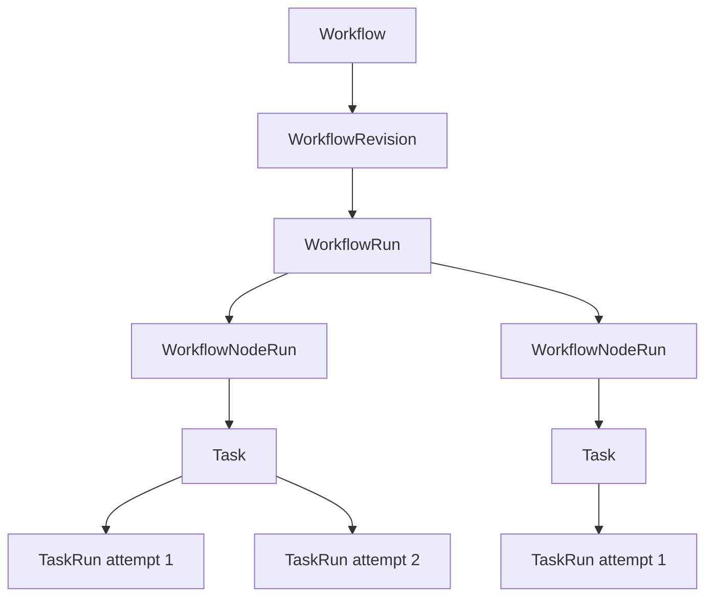
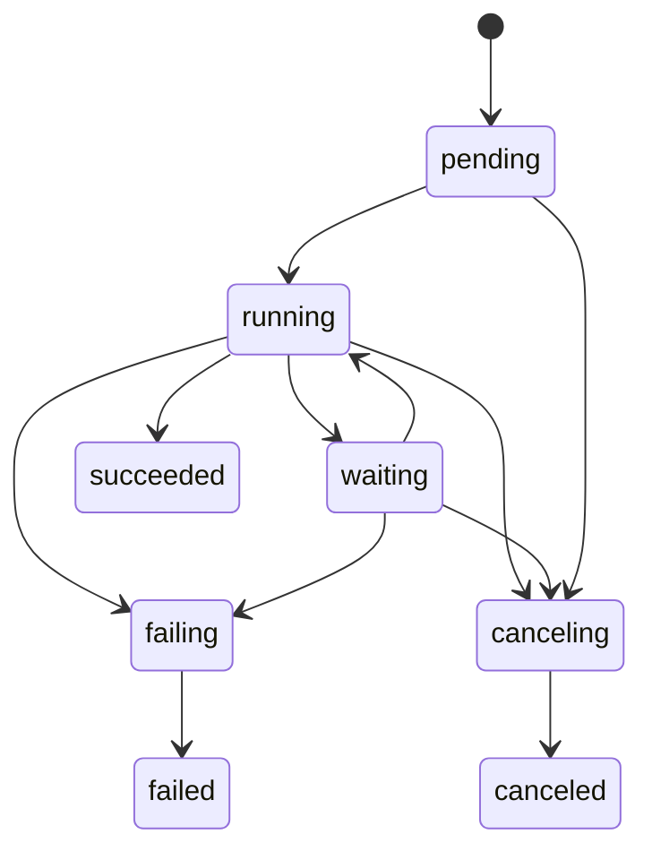
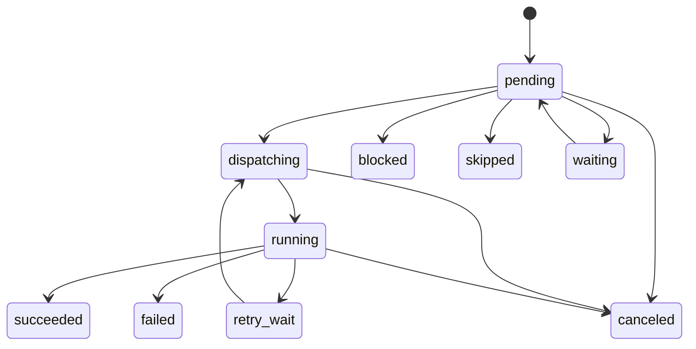

# Workflow Runtime

> **翻译说明：** 本文是[英文原文](../../design/workflow-runtime.md)的简体中文派生翻译。若中英文存在语义冲突，以英文原文为准。


> **受众：**贡献者、产品评审者和运营人员 · **状态：**计划中——方向已确定；当前实现仍是线性的、由回调驱动的前身

相关文档：[路线图](../ROADMAP.md)、[产品愿景](产品愿景.md)、[表面定位](界面定位.md)、[Agent 执行与 Task 线程](Agent执行与Task线程.md)、[Space 治理](Space治理.md)、[统一 Artifact](统一工件.md)、[数据模型](../contribute/architecture/data-model.md)和[验证计划](验证计划.md)。

## 目录

- [1. 决策与当前状态](#1-决策与当前状态)
- [2. 问题与设计原则](#2-问题与设计原则)
- [3. 目标](#3-目标)
- [4. 非目标](#4-非目标)
- [5. 领域模型与所有权](#5-领域模型与所有权)
- [6. Workflow 定义契约](#6-workflow-定义契约)
- [7. 校验与发布](#7-校验与发布)
- [8. 运行与节点状态机](#8-运行与节点状态机)
- [9. 输入、输出与信任边界](#9-输入输出与信任边界)
- [10. 协调](#10-协调)
- [11. 调度与幂等性](#11-调度与幂等性)
- [12. 失败、重试、超时与取消](#12-失败重试超时与取消)
- [13。 适应性和模式决定的控制](#13-适应性和模式决定的控制)
- [14。 人类的持久要求](#14-人类的持久要求)
- [15.服务,API，以及商店合同](#15服务api以及商店合同)
- [16。 坚持目标](#16-坚持目标)
- [17。 Portal 经验和运营经验](#17-portal-经验和运营经验)
- [18。 安全，配额和执行政策](#18-安全配额和执行政策)
- [19。 交付和迁移](#19-交付和迁移)
- [20。 验证](#20-验证)
- [21。 考虑其他方法](#21-考虑其他方法)
- [22。 基于证据的追踪](#22-基于证据的追踪)

## 1. 决策与当前状态

BuildMax Workflow 是构建在现有 Task 和 TaskRun 执行平面之上的、由 Space 管理、固定修订版本、可持久化且可自适应的图。

Workflow 运行时负责：

- 已声明的依赖关系和路由；
- 不可变的运行输入和解析后的节点输入；
- 节点就绪、重试、超时、等待、取消和完成；
- 持久化调度与重启恢复；
- 每个逻辑节点被接受的输出；以及
- 一个权威的 WorkflowRun 结果。

`agent_task` 节点将开放式工作委托给 Task 和 TaskRun。它不会另行实现模型循环、工具系统、Session 格式、沙箱、Plugin 加载器、trace 或 Artifact 存储。Agent 可以在自己的 TaskRun 中规划、搜索、调用工具、创建子代理或调整方案；这些都属于 Agent 执行。模型只有返回一个已发布定义允许、并由 Workflow 运行时验证和记录的值时，才能影响 Workflow 控制。

边界可以简述为：

> 模型可以提出决定；Workflow 运行时负责验证、提交并记录该决定。

目标是支持自适应，而不只是静态图。首个交付版本仍是无环的声明式图；后续的规划器、路由器、评估器和 map 模式可以根据声明式模板生成数量受限的运行时节点。任何模型都不能隐式修改正在运行的图。

### 1.1 当前已有内容

当前实现已经具备一些有用的基础：

- Workflow 和 WorkflowRun 归 Space 所有；
- 定义和修订版本会被记录；
- 每次运行固定一个 Workflow 修订版本；
- 每个步骤都委托给共享的 Task/TaskRun Worker 路径；
- 步骤行会复制 Agent 内容以保留来源；
- 手动运行和由 Issue 发起的运行已经存在；以及
- Portal 可以编写线性定义并查看其运行。

但这还不是本文设计的运行时。当前定义是带静态提示的有序 `steps` 数组；运行没有输入或结果契约，步骤无法绑定前一步的输出，只保留 500 个字符的摘要，下一步通过进程内尽力而为的终态回调调度。运行创建、步骤创建、Task 准入和步骤关联是分开的写操作；并发或重复推进可能造成重复工作，服务器崩溃也可能让已完成 TaskRun 的运行悬挂。

当前 Agent 快照也不是执行权威。Workflow 会将旧 Agent 指令复制到 Task 用户输入中；Task 准入时，Worker 还可能重新解析最新的 Agent 系统指令。因此一次编辑可能把旧指令作为不可信用户内容，与新指令作为可信系统策略组合起来。目标设计会固定一个 Agent 修订版本，并通过共享运行时使用它。

### 1.2 路线图定位

静态图执行是 R5 能力，应在 R0–R4 的运行与资格验证证据之后再选择；只有具体部署提供了证据和优先级时，才会提前。动态扩展、人工等待、计划任务和入站事件仍属于后续阶段。

## 2. 问题与设计原则

Agent 时代的工作流结合了两类不同的计算：

1. **语义计算**：正确的下一步取决于含义、不完整的信息、搜索和判断；以及
2. **有状态协调**：系统必须跨故障保留授权、幂等性、重试限制、截止时间、结果和恢复信息。

LLM 适合第一类工作，却不能独自成为第二类工作的权威；确定性图适合第二类工作，却无法枚举开放式任务的全部路径。把二者当作竞争引擎，最终只会得到脆弱的提示链或无法审计的自主过程。

设计遵循以下原则：

### 2.1 确定性权威，Agent 执行

Workflow 负责事实和策略；Agent 节点负责语义工作。模型输出在确定性状态转换根据已发布契约验证之前，只是数据。

### 2.2 持久化事实，而不是进程记忆

Goroutine、HTTP 请求、回调、套接字或某个 Server 进程可以降低延迟，但绝不能决定运行是否完成。即使这些进程内状态全部丢失，基于已存储的 Workflow 和 TaskRun 事实进行的协调也必须得到相同结果。

### 2.3 类型化边界，而不是提示词拼接

Workflow 输入、节点绑定、节点输出、路由和人工响应都应具有 schema 或小型标准封装。上游模型输出必须明确标记为不可信上下文，不能拼接进 Agent 系统策略。

### 2.4 静态策略边界，受限的动态工作

已发布的修订版本声明允许使用的 Agent 修订、节点模板、路由、预算和扩展上限。规划器可以在这个边界内选择工作，但不能在运行时引入新的 Agent、工具授权、Secret、沙箱级别或无界图。

### 2.5 一个执行平面

Task 加 TaskRun 仍是唯一持久化的 Agent 执行平面。Workflow 不复制 Agent 循环，也不与 TaskRun 争夺结果、trace、用量、Artifact、Worker 或取消的所有权。

### 2.6 专用优先于通用

BuildMax 不是 BPM、集成、ETL 或任意代码执行产品。在具体用例证明一个确定性的第二执行器比 Agent 工具调用更安全、更清晰之前，一个 `agent_task` 执行器就足够了。

这些原则与 [OpenAI Agents SDK](https://openai.github.io/openai-agents-python/multi_agent/) 对代码决策与模型决策编排的区分、[Anthropic](https://www.anthropic.com/engineering/building-effective-agents) 和 [LangGraph](https://docs.langchain.com/oss/python/langgraph/workflows-agents) 对 Workflow 与 Agent 的区分，以及 [Temporal](https://docs.temporal.io/workflows) 对确定性历史与外部活动边界的做法一致。BuildMax 采用这种分离思路，而不采用任何框架的运行时或 DSL。

## 3. 目标

- 在节点之间传递完整、可检查的数据和 Artifact 引用。
- 使用经过验证的不可变输入接纳 WorkflowRun，并产生一个持久化结果。
- 在回调丢失、Server 重启、Worker 丢失和并发协调后恢复已接纳的运行。
- 保持Task加上TaskRun作为Agent执行和尝试模型。
- 固定稳定重试语义所需的每一项执行敏感定义。
- 在一个 DAG 模型中表达顺序、静态扇出和扇入。
- 增加模型路由和有界图扩展，但不把系统权威交给模型。
- 让用户和运营人员看见尝试、绑定、路由、等待、跳过、失败和取消。
- 保持 Go 运行时可移植，普通私有部署无需新增服务。
- 先让 Portal 编写最简单且有用的形式，再考虑大型画布。

## 4. 非目标

- 取代 Temporal、Airflow、n8n、Zapier 或通用业务流程引擎。
- 向 Workflow 添加任意 Shell、SQL、JavaScript 或 HTTP 节点。
- 把每次工具调用、配套操作、交换或模型转换都表示为 Workflow 节点。
- 提供所有外部副作用都严格执行一次的语义。BuildMax 只保证内部接入的幂等性；各个系统 Agent 必须自行定义副作用语义。
- 创建一个可自由变更的全局状态字典。
- 让模型生成并执行任意图、Agent ID、工具集、凭证或策略。
- 在运行等待人工或外部事件时占用 Worker。
- 让 Conversation 或 Issue 成为执行父级。
- 把 Workflow 编写迁移到 Space、CLI 或 Desktop；Portal 仍是完整的管理界面。
- 要求 Go 核心依赖外部工作流运行时、节点或 Python。
- 通过交互式解释器实现工作流运行时。

## 5. 领域模型与所有权



| 对象 | 负责内容 | 不负责内容 |
|---|---|---|
| Workflow | Space 范围内的身份、草稿指针、已发布指针和归档状态 | 可变的运行状态 |
| WorkflowRevision | 不可变的规范定义、schema、绑定、节点策略和 Agent 修订引用 | 某次运行的输入或结果 |
| WorkflowRun | 修订版本固定、输入、聚合状态、结果、触发来源、取消意图和协调计划 | Agent Session 内部状态 |
| WorkflowNodeRun | 一个物化的逻辑节点、解析后的输入、已接受输出、策略状态、Task 关系和尝试聚合 | Worker 租约或 Agent 循环 |
| Task | 一个 Agent 节点的持久目标和 Session 身份 | 图就绪状态或路由决策 |
| TaskRun | 一次尝试、输出、Artifact、trace、用量、运行时物化状态和失败信息 | Workflow 成功策略 |
| WorkflowRequest | 未来需要审批或类型化信息的持久请求 | 被阻塞的 Worker 或普通 Agent 完成 |
| Conversation | 可选的前台来源和结果卡片 | Workflow 状态或授权 |
| Issue | 共享的工作与结果上下文 | Workflow 协调状态 |

包所有权遵循仓库的依赖方向：

- `internal/core/workflow` 负责定义解析、规范化验证、纯粹的就绪计算以及合法的运行/节点状态转换；
- `internal/service/workflow` 负责发布、准入、协调，以及 Workflow、Task、Agent、Issue、配额和未来请求端口之间的协调；
- `internal/infra/db` 负责行结构、原子准入、CAS 状态转换、唯一幂等键、租约和到期运行查询；
- `internal/service/task` 负责 Task 与首个 TaskRun 的原子准入、重试和取消；
- `internal/agentapp/taskrun` 继续组装并执行已固定的 Agent 运行时；以及
- handler 和 Portal 只在边界处做翻译，绝不重新实现图决策。

一个逻辑 `WorkflowNodeRun` 拥有一个 Task。Retry 会在该 Task 下创建额外的 TaskRun，并记录 `retry_of_task_run_id`。这样既保留一个目标和一条 Agent Session 谱系，又让每次尝试都能独立调度、计量、追踪并进入终态。用户可以查看 Workflow 所拥有的 Task，但不能直接 Continue 或 Retry；这些操作属于协调器。

## 6. Workflow 定义契约

首个版本定义是`schema_version: 1`.未变化的当前`steps`格式是Alpha前，并且被取代，并不是被视为方案版本0。

法式的形状是：

```json
{
  "schema_version": 1,
  "input_schema": {
    "type": "object",
    "required": ["topic"],
    "properties": {
      "topic": {"type": "string"}
    },
    "additionalProperties": false
  },
  "policy": {
    "max_parallel_nodes": 4
  },
  "nodes": [
    {
      "id": "research",
      "type": "agent_task",
      "agent": {
        "id": "agt_researcher",
        "revision": 3
      },
      "needs": [],
      "input": {
        "instruction": "Research the supplied topic and identify uncertainty.",
        "bindings": {
          "topic": {
            "source": "workflow.input",
            "pointer": "/topic"
          }
        }
      },
      "issue_access": "if_bound",
      "policy": {
        "timeout_seconds": 1800,
        "max_attempts": 2
      }
    },
    {
      "id": "write",
      "type": "agent_task",
      "agent": {
        "id": "agt_writer",
        "revision": 5
      },
      "needs": ["research"],
      "input": {
        "instruction": "Write the final report from the supplied research.",
        "bindings": {
          "research": {
            "source": "node.research.output",
            "pointer": ""
          }
        }
      },
      "issue_access": "none",
      "policy": {
        "timeout_seconds": 1800,
        "max_attempts": 1
      }
    }
  ],
  "result": {
    "source": "node.write.output",
    "pointer": ""
  }
}
```

### 6.1 定义 schema

`input_schema` 是用于运行入口校验和生成 Portal 输入表单的 JSON Schema 子集。实现会在 API 中记录支持的子集；包含不支持关键字的定义无法发布。

虽然 `nodes` 在 JSON 中表示为数组，但在执行语义中是无序集合。节点位置不是控制流；节点由 `id` 标识，并根据 `needs` 以及未来的路由激活条件变为就绪。

为了保证可复现性，正式发布的修订必须同时提供 `agent.id` 和 `agent.revision`。Portal 可以允许草稿使用 `latest` 以便编辑，但发布时必须解析为现有的不可变 Agent 修订并保存其编号；启动运行时绝不会解析 `latest`。

节点的 Task 指令位于 `input.instruction`。`input.bindings` 为 Task 指定可用值；绑定源可以是 `workflow.input` 或 `node.<node_id>.output`。

`pointer` 是 RFC 6901 JSON Pointer；空字符串选择整个值。BuildMax 不在本契约中实现 JSONPath 过滤器、函数、表达式或文本模板求值。

`issue_access` 控制节点是否可以访问 Issue：

- `none`：Task 不获得 Issue 关系或 Issue 范围的运行时访问；
- `if_bound`：仅当运行绑定了 Issue 时，Task 才获得该运行的 Issue；
- `required`：除非 WorkflowRun 具有 Issue，否则无法准入。

这使得Issue的功能明确，而不是意外地向每个节点授予它或默默地将其从每个节点中保留。

`max_attempts` 默认为 1。自动重试是显式选择的，因为 Agent 可能在失败前产生外部副作用。定义上限和部署上限都会在发布与准入时校验。

`result` 通过一个节点输出选择 WorkflowRun 结果。所选节点必须可达，并且不能在任何有效的首版路径上被跳过。

### 6.2 第一个版本图表规则

- 子代理 `needs`
- 任何引用的前任都存在。
- 结合只可指向Workflow输入或过渡前身。
- 一个节点在每个需要的前任成功后就准备好了。
- 几个准备节点可以同时执行在Workflow和Space限制范围内。
- 失败是失败速度；第一图没有继续错误的政策
切片。
- 执行器类型只有一个，是`agent_task`。
- 未知字段未能验证。
- 执行定义的 UI布局不属于执行定义。
单独存储，以便移动一个框不会部署新的行为修改。

## 7. 验证和出版

标识，草案历史，出版和档案状态是分别的： Workflow

```text
Workflow
  draft_revision -------- save / validate / test
  published_revision ---- immutable target for new runs
  archived_at ------------ refuses new runs; preserves history
```

每个语义编辑都添加一个工作流程修改，并条件地推进`draft_revision`.修改是不可变的.出版不会重写修改：它执行了比较和设置更新`published_revision`从预期的当前值到所选的草案.现有审计轨迹记录演员，老指针，新指针和时间。

编辑后添加一个新的草案修改，并留下`published_revision`不变.恢复旧内容添加它作为一个新的草案；它不会默默部署它.档案拒绝新运行录取，但不会改变修改指针或影响已经录取的运行。

出版证实和定制整个合同：

1. 无知场拒绝和尺寸限制的解码；
2. 验证支持的输入和可选输出方案子集；
3. 验证节点ID，类型，图形周期性，引用和结果可访问性；
4. 解决AgentID和Space内部的修改，包括删除的代理
已记录的修订政策；
5. 验证Issue要求，重新尝试，截止时间，同步和扩展
限制；
6. 定位化JSON并计算定义哈希；以及
7. 只有预期的草案和已发布的指标，才能移动已发布的指标
现在还可以。

采用 Run 录取，重复了可能在发布后发生变化的授权和可用性检查，但它执行了正规修改.它不会取代固定的 Agent 修改或重新写成图表，并将当前的 Agent 内容。

试运是一个真正的WorkflowRun标记为触发源`workflow_test`.它获得了正常的配额，政策，跟踪和Artifact行为，并显然是测试.一个干跑验证器不调用模型，也不声称预测Agent的成功。

## 8. Run 和节点状态机

### 8.1 Run 录取

执行这些操作在一个数据库交易中： `StartRun`

1. 解决Space所有的Workflow和目前公布的修订；
2. 授权调用者和触发器；
3. 验证提供输入和要求的Issue关系；
4. 插入一个WorkflowRun，并列出了精确的修改，不可变的输入，触发器，
无效密钥和`pending`状态；
5. 实现一个具有`pending`状态的静态节点工作流NodeRun；以及
6. 加入入学活动。

在此交易中没有创建Task。 提交后，调用者会唤醒调停器。 由于正常运行扫描，在警钟之前发生了崩。

### 8.2 WorkflowRun国家



- 已被录取并实现；尚未进行发送。 `pending`
- 子：至少一个节点可能已经准备好，发送，运行或重新尝试。 `running`
- 无工作者工作活动，运行等待长久的外部 `waiting`
在请求节点发送之前，这个状态是不使用的。
- 果： 失败快速已犯下终结原因和积极的兄弟工作 `failing`
已取消或被排水。
- 系统取消的用户或授权者获胜了运行过渡； `canceling`
任何新节点都不能发送。
- 终端:`succeeded`,`failed`，以及`canceled`。

成功需要声明的结果结合，才能解决和验证.一个运行不会成为终端，因为它仍然拥有活跃的TaskRun.`failing`和`canceling`使排泄物可见，而不是标记运行终端，而工人效果仍然可以到达。

### 8.3 工作流程NodeRun国家



- 相关标识符：尚未被要求；准备性取而不是存储。 `pending`
- 编者拥有试图录取申请。 `dispatching`
- 链接`running`：链接TaskRun是非终端的。
- 之前的尝试失败，明确的重试政策允许 `retry_wait`
后来尝试。
- 未来请求节点具有持久的未完成请求，并消耗 `waiting`
没有工人。
- 作为这个逻辑节点的输出，一个`succeeded`：一个TaskRun结果被接受。
- 试验已耗尽或无法满足节点合同。 `failed`
- 已关闭评论： 已关闭评论： `blocked`
- 已关闭的关键： `skipped`
- 运行取消被阻止或停止执行。 `canceled`

每个过渡名称都预期的预期状态，并在适当的情况下预期的尝试号码.输掉比赛的更新返回正常冲突/无运；调用者重新阅读事实，从来没有投机地重复外部行动。

## 9. 输入，输出，信任的限制

接入后,WorkflowRun输入是不可变的.一个节点的解决输入仅由该输入，不可变的成功前任输出和接受的持久请求响应计算.当节点被要求进行第一次尝试时，它变得不可变，并且在重试时被重新使用字节对字节。

首个节点输出合同是标准封面：

```json
{
  "text": "full TaskRun output",
  "structured": null,
  "artifacts": [
    {
      "id": "art_example",
      "path": "report.md",
      "media_type": "text/markdown"
    }
  ],
  "task_id": "tsk_example",
  "task_run_id": "trn_example"
}
```

`text`是完整的 TaskRun输出，而不是当前的显示总结。 `artifacts`包含稳定的 Artifact引用，明确归因于被接受的 TaskRun.协调员不会将任意文件复制到后续的工作空间中.后来的 Agent将引用作为数据接收，并通过正常授权功能访问 [阅读中文镜像](Workflow运行时.md)。

`structured` 没有或 `null` 运行时间共享到 Agent 实现提供商中立结构输出合同.当存在时，运行时间不是 Portal 解析器在节点成功之前对节点的 `output_schema` 进行验证.需要结构输出的路线或规划器不能宣布直到运行时间支持其方案之前发布。

试图成功的结果是通过一个试验输出，输出的结果是 TaskRuns。

结果采用相同的包裹或选定的JSON子树，并独立存储在运行中.Issue和Conversation表面可能会投影一个结果，同时保留链接到节点Tasks和TaskRuns作为来源.中节节点输出并不是所有呈现为竞争的最终答案。 WorkflowRun

### 9.1 快速和政策分离

采用了Agent TaskRun的四种不同输入类型：

1. 系统政策和从被上的Agent修订中获得的Agent指令；
2. 节点的作者任务`instruction`作为用户意图；
3. 已解决的结合，以稳定的标记数据包呈现；以及
4. 运行能力和运行时间物质化提供在带外。

提升输出不值得信赖，即使另一个SpaceZAgent生产它.染器必须界定它并说这是数据，而不是指令.它不能将Agent指令复制成用户输入，评估从上游内容中的模板，或推广模型文本为系统政策。

图本身是足够的 Workflow状态：

```text
immutable run input
+ immutable accepted node outputs
+ durable request responses
```

设计中没有可变的全球词典.后来的共享状态功能需要明确的冲突，来源和方案模型，而不是未类型的JSON列。

## 10. 调和

协调器是一个持续的状态机器，而不是一个长时间的过程。

```go
func (s *Service) Reconcile(ctx context.Context, workflowRunID string) error
```

通过TaskRun终端通知，定期进行应运扫描，在服务器启动恢复期间或两个服务器复制器竞赛后，相同的操作是安全的。

一个调解通行证：

1. 获得限额WorkflowRun租合同，如果没有未到期的租合同；
2. 读取固定的修订，运行，节点行，链接的Tasks和TaskRuns，
持久的请求事实；
3. 结端子TaskRun事实到它们的NodeRuns中与比较和设置
过渡；
4. 执行时间限期，重新尝试，故障传播和取消决定；
5. 取出了所有悬而未决的节点，其依赖性和路线激活性是
满足；
6. 解决和存储每个索赔的节点输入；
7. 无权获取或恢复Task和TaskRun；
8. 取出总运行状态和声明结果；
9. 设置`next_reconcile_at`用于仍需要观察的工作；以及
10. 释放租。

租减少了重复计算；它不是正确性机制.正确性来自于独特的录取密钥，不可变的事实和有条件的过渡.如果租合同在所有者活着的时候过期，另一个过程可以重复调整，而不需要重复Task或接受结果两次。

报道已终端 TaskRun 呼叫回复仅作为一个警觉.其故障是记录和恢复的应运行查询.报道已经终端 TaskRun 不需要复制回复，因为 Workflow 调整器读取终端行本身。

由于运行的扫描仪选择了`next_reconcile_at`的非终端运行，其`next_reconcile_at`是由于或租期限过期的.它使用有限的批量和后退.一个运行具有活跃的TaskRun检查不多，当回调工作，仍然有有限的恢复限制，当他们没有。

## 11. 发送和无能

节点发送通过Workflow和Task店铺.它不能依赖于一个数据库交易，涵盖员工执行,Task的创建必须通过Task服务而不是直接的Workflow表写。

每个逻辑节点都有一个稳定的Task接入密钥：

```text
workflow/<workflow_run_id>/node/<node_id>
```

每次重试都具有稳定的TaskRun入口密钥：

```text
workflow/<workflow_run_id>/node/<node_id>/attempt/<attempt_number>
```

应用服务Task接受以下密钥和保证：

- 一个Space，并通过一个Task的接入密钥；
- 首先电话原子生成Task加上第一个TaskRun；
- 复制调用后返回相同的Task和TaskRun；
- 试用重复键在现有的Task下解决为一个TaskRun；以及
- 对于现有钥匙的相矛盾的有效载荷，则被拒绝，而不是被忽视。

发送过程如下：

```text
CAS node pending/retry_wait -> dispatching
                    |
                    v
idempotently admit Task or retry TaskRun
                    |
                    v
CAS node dispatching -> running and link ids
```

重要的崩窗口是Task录取后和NodeRun链接前.在恢复时，协调员再次使用相同的键调用录取，接收现有的Task/TaskRun，并完成链接.它永远不会猜测没有连接的Task。

商店至少要求：

```text
UNIQUE(workflow_run_id, node_id)
UNIQUE(space_id, task_admission_key)
UNIQUE(task_id, task_run_admission_key)
```

公共ID在API和日志中出现在.内部数值密钥根据实体身份设计实现关系指数。

## 12. 失败，再试，休息，取消

### 12.1 失败政策

首先，图表的政策是快速失败.当一个需要的节点耗尽了尝试时：

1. 节点成为`failed`，具有稳定的错误代码和诊断信息；
2. 跑步条件是进入`failing`；
3. 没有新节点发送；
4. 活跃的兄弟姐妹TaskRuns收到取消意图；
5. 无法成为未成年后代的`blocked`；
6. 活动工作结束后，跑步成为`failed`。

协调员，工人，提供商，合同验证，截止时间和Agent报告的故障仍然可分辨.模型质量故障不被重新标记为协调员故障。

### 12.2 尝试一次

`max_attempts`包括第一次尝试和默认故障。 复试必须明确，因为TaskRun可能在返回故障之前产生了外部副作用。

为了重新尝试：

- 重新使用相同的 WorkflowNodeRun 和 Task；
- 接下来的TaskRun记录`retry_of_task_run_id`；
- 解决的节点输入是字节相同的；
- 编辑器:Agent id 和修改，插件发布针，请求的沙箱政策，名称
秘密消费,Issue关系，以及模型要求仍然固定；
- 每次尝试都保留了自己的输出，追踪，使用,Artifact属性，
失败；以及
- 边界背面的表格是`retry_wait`和`next_attempt_at`。

秘密值不被复制到Workflow状态中.Space 秘密目前未被分类，因此每个尝试通过正常运行传输接收了已经固定的秘密名称的当前值，并记录了实现.凭证旋转是故意可见的行为，而不是比特对比特重播。

实际提供商路由可能会发生变化，如果基础设施失败，则依据相同的模型请求和网关政策。

### 12.3 时间休息

节点时间停止由协调员从存储的最后期限开始.它要求取消活跃的TaskRun，直到TaskRun终结之前不会再尝试.Worker的生命处理提供最终终结现实，如果一个工人消失。

Workflow截止日期阻止新的发送，并将运行通过 `failing`移动，除非已通过用户取消已将运行移动到 `canceling`。

### 12.4 取消和种族

取消是WorkflowRun上记录的意图，而不是HTTP处理器碰巧看到的行列上的循环.`canceling`的成功CAS确定没有后续调整可以发送工作。 活跃的TaskRuns通过Task服务收到取消；正在等待或重新尝试的节点成为`canceled`；已承诺的路线的节点仍然被排除在 相关标识符之外。 `skipped`

首次承诺的运行级转型获胜：

- 如果结果完成首先承诺，后续取消将返回终端冲突；
- 如果取消的承诺是先的，后来的TaskRun成功不会重新标记运行；
- 如果失败首先发生，随后取消不会掩盖失败；以及
- 复制取消是无效的。

预期状态更新，而不是时间标签比较。

## 13. 适应性和模式决定的控制

静态DAG是交付的基础，而不是最终表达式上限.通过发布的修订预期的值，添加适应控制。

### 13.1 类型路线

常规`agent_task`可能声明出口方案，如：

```json
{
  "type": "object",
  "required": ["route"],
  "properties": {
    "route": {
      "enum": ["approved", "needs_revision", "reject"]
    }
  },
  "additionalProperties": false
}
```

定义地图显示了每个允许值的定义.运行时间验证了结构化输出，记录了原始的TaskRun结果，验证的值,Agent/模型修改，选择的路线和跳过的继任者，然后执行确定性过渡.不有效的输出遵循节点的明确重试政策，否则会失败节点。

首先没有单独的路由器执行器.如果它后来拥有不同的政策或执行，而不是不同的Portal标志，则一个不同的类型只会被证明是合理的。

### 13.2 限制规划和地图

规划器返回数据，例如：

```json
{
  "tasks": [
    {"key": "market", "objective": "Research the market"},
    {"key": "technology", "objective": "Research the technology"}
  ]
}
```

已公布的定义包含了工人模板和限制：

```json
{
  "expand": {
    "source": "node.plan.output",
    "pointer": "/structured/tasks",
    "template": "research_worker",
    "key_pointer": "/key",
    "max_items": 10,
    "max_parallel": 4
  }
}
```

运行时间验证项目数量，独特密钥，项目方案，总图表界限和模板参考，然后实现儿童 NodeRuns 具有确定性ID，如`research_worker[market]`。 模板修复了Agent修订，绑定，问题访问，重试，截止时间，工具政策和成本包裹。 规划器输出不能选择其之外的替代方案。

### 13.3 评估者循环

发布的图表仍然是循环不的.一个评估者可以要求`pass`或`revise`；一个声明的边界代模板实现下一个编写和评估节点：

```text
write[1] -> evaluate[1] -> write[2] -> evaluate[2]
```

定义必须设定最大的代，总扩展，最后期限和预算.每个代具有不可变的输入和独立的TaskRun来源.运行时间从来没有覆盖过之前的代来模拟循环。

### 13.4 产品限额

一次的开放目标通常应该是直接的Agent Task.一个Workflow是当一个过程需要重复使用，稳定的数据合同，治理，多阶段所有权，耐用性或可检查结果时获得的.这防止生成的图像成为一个Agent已经表现更好的工作周围的仪式。

## 14. 人类的持久要求

批准和缺失信息是未来的持久请求类型，不阻止Agent调用，而不是NodeRun上的布鲁列。

一个工作流动请求拥有：

- Space、WorkflowRun 和 NodeRun 标识；
- 要求类型和输入的请求有效载荷；
- 允许的响应方案；
- 申请人和符合条件的响应者角色或身份；
- 相关内容 `pending` `answered` `expired` `canceled`
- 过期和反应因素/时间；
- 响应有效负载和审计相关性；以及
- 答案的一个无能关键。

没有其他工作时，运行是`waiting`.它不消耗任何工作人员.响应交易记录了答案并唤醒了和解.重复或未经授权的答案不能恢复两个路径。

在设计时，该模型必须与Space治理批准模型相结合.Workflow不得以孤立批准特征的委托，角色，过期，升级和审计语义方式先行。

## 15.服务,API，以及商店合同

### 15.1 申请服务

概念上,Workflow服务拥有这些运营：

```go
type Service interface {
    SaveDraft(context.Context, SaveDraftCmd) (*Revision, error)
    Publish(context.Context, PublishCmd) (*Workflow, error)
    StartRun(context.Context, StartRunCmd) (*Run, error)
    CancelRun(context.Context, CancelRunCmd) (*Run, error)
    Reconcile(context.Context, string) error
}
```

随着`PublishCmd`的预期草案和发布的修订,`StartRunCmd`的运载是Space,Workflow，可选的明确发布修订，不可变的输入，可选的Issue，触发源，演员和调用者无权密钥。

要求Task端口为Workflow的狭窄：

```go
type TaskExecution interface {
    AdmitWorkflowTask(context.Context, AdmitWorkflowTaskCmd) (*Task, *TaskRun, error)
    RetryWorkflowTask(context.Context, RetryWorkflowTaskCmd) (*TaskRun, error)
    RequestCancel(context.Context, string, Actor) error
}
```

Workflow不直接调用数据库下载类型或 Agent运行时间。

### 15.2 存储能力

商店不仅将基于目的的原子操作暴露在一般部分更新中：

- 附加预期的当前修订草案；
- 发布预期的修订；
- 允许原子运行和静态 NodeRuns；
- 返回一个运行快照，其修改和节点已被固定；
- 列出未终端行驶的行驶；
- 要求并续签限额和解租；
- 要求一个节点从预期状态，并尝试；
- 连接被无权承认的TaskRun；
- 接受终端结果一次；
- 预期尝试的重新试验时间表；
- 记录取消或故障意图；
- 通过有证据的理由终结悬而未决的节点；以及
- 完成从预期的总体状态的运行，并获得一个结果。

操作器或服务不得复制其中状态违反模型的通用`Update`调用序列。

### 15.3 HTTP表面

目标表面延伸了现有Space扩展路线：

```text
POST /api/spaces/{space_id}/workflows/{workflow_id}/revisions
POST /api/spaces/{space_id}/workflows/{workflow_id}/publish
POST /api/spaces/{space_id}/workflows/{workflow_id}/runs
GET  /api/spaces/{space_id}/workflow-runs/{workflow_run_id}
POST /api/spaces/{space_id}/workflow-runs/{workflow_run_id}/cancel
```

接受Run的入学接受：

```json
{
  "workflow_revision": 7,
  "input": {"topic": "Agent workflow"},
  "issue_id": "iss_example",
  "idempotency_key": "caller-generated-key"
}
```

输出`workflow_revision`选择了录取交易内部的当前发布的修订.提供它只允许授权测试或固定调用，只有当它是允许的发布/测试修订.普通用户不能通过猜测一个数字执行任意的历史定义。

录取返回 `202 Accepted`与持久运行。 HTTP 寿命从来都不代表 Workflow 寿命.运行细节响应包含总体状态，输入，结果，节点总结，尝试，等待，错误和链接； TaskRun 痕迹和大型 Artifact 内容仍然落后于其所有 API。

未来请求响应使用：

```text
POST /api/spaces/{space_id}/workflow-requests/{request_id}/respond
```

## 16. 坚持目标

在 `internal/infra/db` 中的行结构仍然是方案的真相来源.下面的表描述是目标，而不是当前的方案文档；数据模型参考只有在实现时才会发生变化。

### 16.1 `workflow`

保留身份,Space，显示字段，创作者和时间邮票.取代单个可变定义/状态/修订权限：

- `draft_revision`；
- 无可取消的`published_revision`；以及
- 无效的`archived_at`。

显示名称和描述是修改的语义内容.Workflow行只能缓存当前的草案值，只要测试保证修改是权威的。

### 16.2 `workflow_revision`

仅附录行包含：

- 编号:Workflow和修订号码；
- 名称和描述；
- 标准定义JSON；
- 方案版本和定义哈希；
- 作者和创造时间。

唯一的关键仍然是`(workflow_id, revision)`.生命周期状态不是修订内容.出版物是Workflow指针加上审计事件。

### 16.3 `workflow_run`

加入或保留：

- 公开ID,WorkflowID，以及精确的Workflow修改；
- 选项Issue标识和输入的触发器来源；
- 电话机关的无限性钥匙；
- 无变性`input_json`；
- 无可变的终端不可变的`result_json`；
- 运行状态和稳定的错误代码/消息；
- 取消行为者/时间；
- 和解所有者，租期限，以及`next_reconcile_at`；
- 创造者和生命周期的时间标签。

采用Run的入口，在拥有Space的内部具有独特的调用密钥，并且触发范围，因此重新尝试的HTTP请求不能创建第二次运行。

### 16.4 `workflow_node_run`

取代`workflow_step_run`。 一行包含：

- 公共ID,WorkflowRunID，以及作者/材料化节点ID；
- 执行器类型；
- 状态和预期状态版本；
- 固定Agent标识和修改；
- 对于诊断所需的可нони性节点定义或定义哈希；
- 无变的解决输入 JSON；
- 附加上成功输出JSON；
- 已接受的 TaskRun 认证； Task
- 现有TaskRun标识，试验计数和下一次试验时间；
- 稳定Task入口密钥；
- 截止日期；
- 跳过/阻/取消/故障原因和诊断信息；以及
- 生命周期时间标签。

唯一的`(workflow_run_id, node_id)`识别了逻辑节点.试验历史从TaskRuns下读取Task而不是被重写到一个节点行。

### 16.5 `workflow_run_event`

添加从第一个持久运行时间段中仅添加一个运行时间线.每个事件包含WorkflowRun，单调序列，可选的NodeRun，事件类型，演员类型/ID，限度编辑有效载荷，相关性ID和时间标签。

事件表是用于审计和UI重建，而不是基于事件的重播.Run和节点行仍然是当前状态的权威.一个变化状态的交易将其事件添加到同一交易中，因此时间表不能要求没有承诺的过渡。

### 16.6 `workflow_request`

只有人能使用可持续的请求才能添加这个表。 它的目标合同在14节；它不需要用于静态图片片。

## 17. Portal 经验和运营经验

编辑序列是这样的：

1. 基于表格的节点,Agent修改选择，依赖性，结合性，结果，
政策；
2. 循环/参考/方案错误的直线验证；
3. 单读的拓形象视觉化，
4. 测试Run，提供输入和完整的时间表；
5. 发布草案与目前发表的修订之间的差异；以及
6. 只有在观察到的作者行为证明了这种操作。

主要创作者单元是一个语义形式，不是原始的JSON，也不是一个帆布.JSON可能仍然是从相同的验证定义中生成的先进视图。

运行页面回答：

- 输入和触发器是什么开始运行的；
- 执行了Workflow和Agent修订；
- 节点准备好，发送，运行，重新尝试，等待，跳过，
封锁或终端；
- 为什么节点采取了路线或没有运行；
- 哪些尝试，每一个消耗和生产的；
- 限制进步的期限，配额，政策或要求；
- 取消或快速排水是否正在进行；以及
- 具有权威的Workflow结果是什么？

它链接到Task和TaskRun页面，用于会议，追踪，工具，使用，以及Artifact细节.它不会将完整的痕迹复制成Workflow行。

运营商需要按故障类的应运后期，最古老的未调整的运行，租年龄，重试计数，恢复延迟，活跃/等待计数和终端结果.这些指标将协调员健康单独描述模型任务质量。

## 18. 安全，配额和执行政策

经理:Space仍然是所有权和授权的边界.所有者和管理者管理定义和出版；成员可以根据现有的治理决定开始发布Workflows.历史修订执行不会被暗示通过阅读访问。

发布和录取证实，每一次Agent修订都属于Space.删除的Agent修订仍然可读，但除非现有Agent生命周期明确允许，否则不能重新选择。

定义不能提供工具，插件，秘密，沙箱访问，或 Issue访问，超越选定的 Agent修改和 Space政策.动态规划器输出缩小或缩小声明的模板；它不能扩大权威。 Workflow

WorkflowRun 和 NodeRun JSON遵守限制尺寸和编辑规则.秘密值永远不会进入定义，输入，输出，事件有效载荷或错误列.TaskRun痕迹仍然由其现有所有者限制和编辑。

配额在运行入口时和每个TaskRun入口时都会检查.运行总结了实际TaskRun的使用和显示成本和未来政策，但TaskRun和LLM的呼叫账本仍然是会计权威.并行发送尊重定义的最低限度,Space，时间表和部署同步限制。

试图，循环和动态扩展宣布硬天花板.达到天花板是Workflow的政策失败，而不是模型的邀请谈判另一个限制。

没有自动重复试验会一次发生外部副作用.Portal必须显示Agent节点是否启用重复试验，并要求创作者指导需要无权工具或接受的重复风险。

## 19. 交付和迁移

### 阶段0： 结基线

- 添加一个“研究后合成”的评估案例，并记录当前引擎无法通过完整输出。
- 添加一个故障测试，将TaskRun结果提交，将回调放下，
现在，我们在电路上着。
- 增加MySQL对双重终端观测的争端覆盖范围，
变化情况： Workflow
- 记录延迟,Task计数，使用和当前操作员恢复行为。

### 第一个阶段：使线性前长久

- 引入预期状态Workflow和步骤过渡。
- 加入具有权限的Task和TaskRun录取权，以获得Workflow所有权。
- 添加`Reconcile`，进行应运扫描，并重新启动恢复。
- 只有调整才能引起和解。
- 加入WorkflowRun取消和连贯的排水行为。
- 停止将Agent指令复制到Task用户输入中，并将Agent
通过员工执行的审核权威。
- 根据明确的临时规则传播Issue关系。

这一阶段没有加上图形特征，它降低了迁移风险，即使后来的产品证据延迟了R5。

### 第二阶段：切断版本数据合同

- 取代未经变化的`steps`定义为`schema_version: 1`。
- 单独的草案和发表的提示。
- 允许不可变的WorkflowRun输入。
- 取代StepRun为NodeRun并保留已解决的输入/全部输出；
- 通过RFC 6901指标将文字和Artifact结合物暴露；
- 存储已声明的WorkflowRun结果；以及
- 项目一结果成 Issue和可选的 Conversation表面。

变换域模型，排列结构，处理器,OpenAPI,Portal，测试和文档.不要同时维护两个定义解释器或保留旧表形状作为兼容性层。 BuildMax

### 阶段3：静态DAG

- 替换为执行权限的数组位置为`needs`。
- 发送所有准备的节点在同步限制内。
- 实现确定性式//和失败式的语义；
- 添加完整的出版验证和仅可阅读的图表；以及
- 保持直线性形式，作为最简单的DAG，而不是单独的发动机。

### 第四阶段：限制政策和类型的决定

- 加入Workflow所有的重试和节点/运行时间。
- 在共享运行时间中添加提供商中性结构化的Agent输出。
- 添加类型的条件路线和可见的决定。
- 加入总使用/成本政策和运营指标。

### 五阶段：根据证据的适应

- 加入Space管理层拥有后的持久外部请求。
- 添加边界规划器/地图扩展。
- 添加限制评估器反复。
- 只有在再使用证据要求的情况下，只添加嵌套的Workflow模板。
- 加入时间表，网页链接或活动触发器，
证明了调整，配额，取消和运营商回收。

数据模型参考保持实实况，随着每个存储片的登陆而发生变化.使用者编写和运行文档是添加的，并附加了相应的Portal表面.可见用户的片段收到正常的变更日志输入。

## 20. 验证

### 20.1 纯域测试

- 严格的解码和加нони化；
- 节点 id 和参考验证；
- 周期检测和结果可达性；
- 具有强制性的成功和失败的RFC 6901；
- 准备进行序列，风，风；
- 任何合法和非法的运行/节点过渡；
- 航线激活和确定性物质化ID，当这些功能运输时；
其他
- 政策和扩张限制。

### 20.2 MySQL 存储测试

检测证明： `./make test mysql`

- 运行和静态节点通过原子进行接入；
- 复制调用者录取返回一次运行；
- 两种调整器一次要求一个节点；
- 采用Task的输入恢复将创建前链接崩窗口关闭；
- 双重终端观测接受一个输出；
- 租期限期权安全收购；
- 发布比较和设置防止丢失更新；
- 取消，失败和成功比赛中，有一个已记录的获胜者；
- 事件序列和当前状态共享。

### 20.3 服务和终结到终结的考验

| 审判 | 需要的证据 |
|---|---|
| 研究，然后合成 | 完整文本和Artifact引用跨越边界，产生一个Workflow结果 |
| 并行审查然后合并 | 机在配额内同时运行；机在等待所有所需的输出 |
| 子代理 Issue Workflow | 只有选择的节点才会获得Issue功能;Issue显示出一个结果，具有来源 |
| 接入Task后重新启动服务器 | 节点恢复相同的Task，并不会重复执行 |
| 丢失终端回调 | 按时扫描观察TaskRun状态，并完成Workflow |
| 两种调整器和复制完成 | 一个Task，一个接受的节点输出，一个终端结果 |
| 试用后的 Agent 编辑 | 复试使用固定的修改和相同的解决输入 |
| 在风扇时取消 | 没有新发送； 已动的TaskRuns收取取消； 运行排水取消 |
| 无效的结构路线 | 显然出现了重试/失败，没有未声明的边缘执行 |
| 发货后的批准等待 | 没有工人被忙；一个授权的答案重新启动后重新启动一条路 |

测量最终结果质量，时间过去了，使用和模型成本，恢复延迟，重复内部效果，手动干预，编写错误和故障类。 根据评估设计，保持Agent质量与协调员，工作者，提供商和评估员的故障分开。

在每次阶段交付前，运行Workflow服务和处理测试,MySQL持久性范围，相关Portal检查，文档检查和`git diff --check`.外部模型评估是故意的，从未被绿色确定性套件所暗示。

## 21. 考虑其他方法

### 21.1 扩展回调序列器

直接添加模板，分支和并行步骤到当前数组是最初便宜的，但保留丢失回调恢复，重复发送窗户，部分录取和隐含数据流.它优化执行语义之前可见的功能，并被拒绝超过1期可靠性修复。

### 21.2让一个LLM管弦乐整个Workflow

管理器Agent在一个开放式Task内很有用，可能会产生子弹.它不是一个持久的Space Workflow：它的背景不是交易日志，它的工具选择是概率性的，它不能成为唯一权威的权限，截止日期，批准，取消或重播.纯的LLM管弦被拒绝为Workflow控制平面。

### 21.3 需要外部耐用 Runtime

时代,Dapr，重复,DBOS等类似系统提供成熟的计时器，重试，等待和运营工具.使一个强制性将增加服务或运行时间依赖性，复制或绕过Task/TaskRun规划和政策，并创建竞争国家当局.它与可移植的单双/私人部署基线相冲突，并被拒绝为默认。

域界限不应阻止未来的企业适配器，但直到现有运行时间的部署证明了必要性并定义了哪些BuildMax事实仍然具有权威性之前，没有抽象性添加。

### 21.4 特定目的数据库协调员

采用MySQL支持的状态机，超过现有的Tasks，保持一个授权，执行，追踪,Artifact，配额和结果平面，并符合部署模型.BuildMax必须具有和解和争端正确性，因此这种选择只能与第20节的故障注射和MySQL证据一起接受。

## 22. 基于证据的追踪

下列不阻碍静态持久图表，也不承诺：

1. 只有当一个实际使用情况不能被定义时，添加一个非Agent执行器
通过Agent工具安全地表达，并拥有自己的授权和
无权合同。
2. 只有重复子图造成维护成本时，只能添加嵌套Workflows
模板不能解决。
3. 只有在具体的部分成功或
倒退语义；不要添加通用`continue_on_error`开关。
4. 仅在不可变的情况下将Artifact内容转载到后来的工作空间中
参考证明不够，复印件，授权，尺寸和
生命周期合同是单独的设计。
5. 仅在使用案例定义冲突后，添加共享可变的Workflow状态，
它们的来源，模式迁移，以及重新尝试行为。
6. 只有当运维人员已经拥有该依赖，并接受 BuildMax TaskRun 作为执行事实、将适配器继续视为协调基础设施时，才增加外部持久运行时适配器。
7. 只有在无效运行后添加时间表和进来的触发器，
资格的政策，取消和运营恢复。
